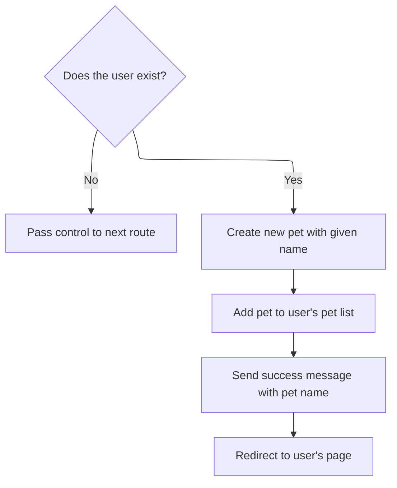
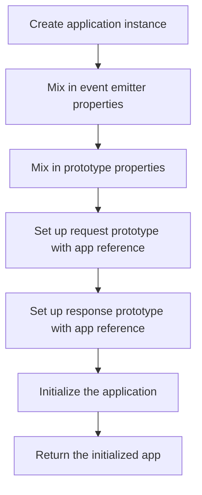
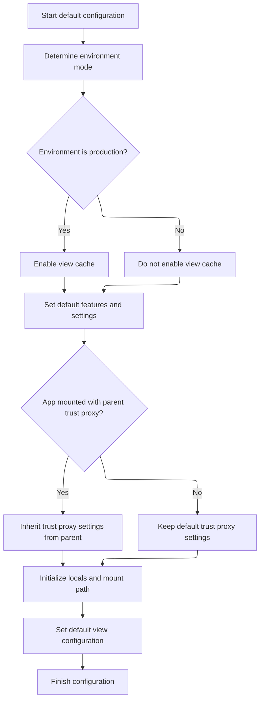

This document explains the flow of creating and initializing the core application instance responsible for handling HTTP requests and routing. The application instance acts as the central component that receives requests, prepares them for routing, applies default configurations, and manages routing through a lazy-initialized router.

The main steps are:

- Define the application instance and delegate request handling
- Prepare request and response objects for routing
- Apply default settings and initialize the app
- Set up lazy router initialization
- Return the initialized application instance

# Starting the application creation

This section defines the creation of the application instance and sets up the core request handling delegation.

<SwmSnippet path="/lib/express.js" line="36">

---

In <SwmToken path="lib/express.js" pos="36:2:2" line-data="function createApplication() {">`createApplication`</SwmToken>, we define the app function to delegate request handling to <SwmToken path="lib/express.js" pos="38:1:3" line-data="    app.handle(req, res, next);">`app.handle`</SwmToken>, then move on to <SwmPath>[lib/application.js](lib/application.js)</SwmPath> to set up the app's core logic and prototypes.

```javascript
function createApplication() {
  var app = function(req, res, next) {
    app.handle(req, res, next);
  };

```

---

</SwmSnippet>

## Preparing request and response for routing

This section prepares the request and response objects for routing by setting headers, establishing circular references, and altering prototypes before passing control to route-specific logic.

| Category       | Rule Name                  | Description                                                                                                                                              |
| -------------- | -------------------------- | -------------------------------------------------------------------------------------------------------------------------------------------------------- |
| Business logic | Initialize Response Locals | If the response object does not have a 'locals' property, it must be initialized as an empty object to store local variables for the response lifecycle. |

<SwmSnippet path="/lib/application.js" line="152">

---

In <SwmToken path="lib/application.js" pos="152:2:2" line-data="app.handle = function handle(req, res, callback) {">`handle`</SwmToken>, we prepare req and res by setting headers, circular references, and prototypes, then move on to the user-pet controller for route-specific logic.

```javascript
app.handle = function handle(req, res, callback) {
  // final handler
  var done = callback || finalhandler(req, res, {
    env: this.get('env'),
    onerror: logerror.bind(this)
  });

  // set powered by header
  if (this.enabled('x-powered-by')) {
    res.setHeader('X-Powered-By', 'Express');
  }

  // set circular references
  req.res = res;
  res.req = req;

  // alter the prototypes
  Object.setPrototypeOf(req, this.request)
  Object.setPrototypeOf(res, this.response)

  // setup locals
  if (!res.locals) {
    res.locals = Object.create(null);
  }

```

---

</SwmSnippet>

### Creating and associating a pet with a user



This section handles creating a new pet and associating it with an existing user, then redirecting to the user's page with a confirmation message.

| Category        | Rule Name                          | Description                                                                                                                    |
| --------------- | ---------------------------------- | ------------------------------------------------------------------------------------------------------------------------------ |
| Data validation | User existence validation          | If the user ID does not correspond to an existing user, the system must pass control to the next route without creating a pet. |
| Business logic  | Pet creation with name             | A new pet must be created with the given name provided in the request body.                                                    |
| Business logic  | Associate pet with user            | The newly created pet must be added to the user's list of pets.                                                                |
| Business logic  | Confirmation message with pet name | After successfully adding the pet, a confirmation message including the pet's name must be sent to the user.                   |
| Business logic  | Redirect to user page              | The system must redirect to the user's page after adding the pet, using a standard HTTP redirect status code (default 302).    |

<SwmSnippet path="/examples/mvc/controllers/user-pet/index.js" line="12">

---

In <SwmToken path="examples/mvc/controllers/user-pet/index.js" pos="12:2:2" line-data="exports.create = function(req, res, next){">`create`</SwmToken>, we extract the user ID and pet name from the request, verify the user exists, then create and associate a new pet with that user. We send a confirmation message and redirect to the user's page. Next, we call <SwmPath>[lib/response.js](lib/response.js)</SwmPath> to handle the redirect logic properly.

```javascript
exports.create = function(req, res, next){
  var id = req.params.user_id;
  var user = db.users[id];
  var body = req.body;
  if (!user) return next('route');
  var pet = { name: body.pet.name };
  pet.id = db.pets.push(pet) - 1;
  user.pets.push(pet);
  res.message('Added pet ' + body.pet.name);
  res.redirect('/user/' + id);
};
```

---

</SwmSnippet>

<SwmSnippet path="/lib/response.js" line="819">

---

In <SwmToken path="lib/response.js" pos="819:2:2" line-data="res.redirect = function redirect(url) {">`redirect`</SwmToken>, we set status and Location headers, support optional status codes, format the body by content type, and handle HEAD requests properly.

```javascript
res.redirect = function redirect(url) {
  var address = url;
  var body;
  var status = 302;

  // allow status / url
  if (arguments.length === 2) {
    status = arguments[0]
    address = arguments[1]
  }

  if (!address) {
    deprecate('Provide a url argument');
  }

  if (typeof address !== 'string') {
    deprecate('Url must be a string');
  }

  if (typeof status !== 'number') {
    deprecate('Status must be a number');
  }

  // Set location header
  address = this.location(address).get('Location');

  // Support text/{plain,html} by default
  this.format({
    text: function(){
      body = statuses.message[status] + '. Redirecting to ' + address
    },

    html: function(){
      var u = escapeHtml(address);
      body = '<p>' + statuses.message[status] + '. Redirecting to ' + u + '</p>'
    },

    default: function(){
      body = '';
    }
  });

  // Respond
  this.status(status);
  this.set('Content-Length', Buffer.byteLength(body));

  if (this.req.method === 'HEAD') {
    this.end();
  } else {
    this.end(body);
  }
};
```

---

</SwmSnippet>

### Routing request after controller processing

<SwmSnippet path="/lib/application.js" line="177">

---

Back in <SwmToken path="lib/application.js" pos="177:5:5" line-data="  this.router.handle(req, res, done);">`handle`</SwmToken>, after the user-pet controller, we delegate to the router's handle method to continue processing the request.

```javascript
  this.router.handle(req, res, done);
};
```

---

</SwmSnippet>

## Completing app creation with prototypes and initialization



<SwmSnippet path="/lib/express.js" line="41">

---

Back in <SwmToken path="lib/express.js" pos="36:2:2" line-data="function createApplication() {">`createApplication`</SwmToken> after returning from <SwmPath>[lib/application.js](lib/application.js)</SwmPath>, we mix in event emitter and prototype methods, expose request and response prototypes linked to the app, initialize the app, and return it. We call <SwmPath>[lib/application.js](lib/application.js)</SwmPath> next to finalize app setup and configuration.

```javascript
  mixin(app, EventEmitter.prototype, false);
  mixin(app, proto, false);

  // expose the prototype that will get set on requests
  app.request = Object.create(req, {
    app: { configurable: true, enumerable: true, writable: true, value: app }
  })

  // expose the prototype that will get set on responses
  app.response = Object.create(res, {
    app: { configurable: true, enumerable: true, writable: true, value: app }
  })

  app.init();
  return app;
}
```

---

</SwmSnippet>

# Initializing app internals

This section initializes the internal state and configuration of the app to prepare it for handling requests and routing.

| Category       | Rule Name                   | Description                                                                       |
| -------------- | --------------------------- | --------------------------------------------------------------------------------- |
| Business logic | Apply default configuration | Apply default configuration to set standard app settings for consistent behavior. |

<SwmSnippet path="/lib/application.js" line="59">

---

In <SwmToken path="lib/application.js" pos="59:2:2" line-data="app.init = function init() {">`init`</SwmToken>, we start by creating empty caches and settings objects to hold app state and configuration. We call <SwmToken path="lib/application.js" pos="66:3:3" line-data="  this.defaultConfiguration();">`defaultConfiguration`</SwmToken> next to set up standard app settings.

```javascript
app.init = function init() {
  var router = null;

  this.cache = Object.create(null);
  this.engines = Object.create(null);
  this.settings = Object.create(null);

```

---

</SwmSnippet>

<SwmSnippet path="/lib/application.js" line="66">

---

Back in <SwmToken path="lib/express.js" pos="54:3:3" line-data="  app.init();">`init`</SwmToken> after returning from <SwmToken path="lib/application.js" pos="66:3:3" line-data="  this.defaultConfiguration();">`defaultConfiguration`</SwmToken>, we continue setting up the app by defining a lazy-loaded router property that creates the router instance on first access, configured by app settings.

```javascript
  this.defaultConfiguration();

```

---

</SwmSnippet>

## Applying default settings to the app



This section applies default settings to the application, configuring environment mode, caching, proxy trust, and view settings to ensure consistent app behavior.

| Category       | Rule Name                                                                                                                                    | Description                                                                                                                                                                             |
| -------------- | -------------------------------------------------------------------------------------------------------------------------------------------- | --------------------------------------------------------------------------------------------------------------------------------------------------------------------------------------- |
| Business logic | Enable view cache in production                                                                                                              | If the environment mode is production, enable view caching to improve performance.                                                                                                      |
| Business logic | Enable <SwmToken path="lib/application.js" pos="94:6:10" line-data="  this.enable(&#39;x-powered-by&#39;);">`x-powered-by`</SwmToken> header | Always enable the <SwmToken path="lib/application.js" pos="94:6:10" line-data="  this.enable(&#39;x-powered-by&#39;);">`x-powered-by`</SwmToken> header to identify the app technology. |
| Business logic | Default query parser                                                                                                                         | Set the default query parser to 'simple' to standardize query string parsing.                                                                                                           |
| Business logic | Subdomain offset default                                                                                                                     | Set the default subdomain offset to 2 to correctly parse subdomains in URLs.                                                                                                            |
| Business logic | Default trust proxy setting                                                                                                                  | By default, do not trust proxy headers unless explicitly configured or inherited from a parent app.                                                                                     |
| Business logic | Inherit trust proxy from parent                                                                                                              | If the app is mounted on a parent app that has trust proxy settings, inherit those settings to maintain consistent proxy trust behavior.                                                |
| Business logic | Initialize locals                                                                                                                            | Initialize app locals as an empty object to store local variables for views and middleware.                                                                                             |
| Business logic | Set mount path to root                                                                                                                       | Set the mount path of the <SwmToken path="lib/application.js" pos="127:3:5" line-data="  // top-most app is mounted at /">`top-most`</SwmToken> app to '/' to define the base URL path. |
| Business logic | Default view configuration                                                                                                                   | Set default view configuration including view engine, views directory, and JSONP callback name for consistent rendering behavior.                                                       |

<SwmSnippet path="/lib/application.js" line="90">

---

Back in <SwmToken path="lib/application.js" pos="90:2:2" line-data="app.defaultConfiguration = function defaultConfiguration() {">`defaultConfiguration`</SwmToken> after setting initial defaults, we finalize app settings by enabling features, setting environment variables, and defining behavior for caching, query parsing, and proxy trust. We also set up inheritance for mounted apps and initialize locals.

```javascript
app.defaultConfiguration = function defaultConfiguration() {
  var env = process.env.NODE_ENV || 'development';

  // default settings
  this.enable('x-powered-by');
  this.set('etag', 'weak');
  this.set('env', env);
  this.set('query parser', 'simple')
  this.set('subdomain offset', 2);
  this.set('trust proxy', false);

  // trust proxy inherit back-compat
  Object.defineProperty(this.settings, trustProxyDefaultSymbol, {
    configurable: true,
    value: true
  });

  debug('booting in %s mode', env);

  this.on('mount', function onmount(parent) {
    // inherit trust proxy
    if (this.settings[trustProxyDefaultSymbol] === true
      && typeof parent.settings['trust proxy fn'] === 'function') {
      delete this.settings['trust proxy'];
      delete this.settings['trust proxy fn'];
    }

    // inherit protos
    Object.setPrototypeOf(this.request, parent.request)
    Object.setPrototypeOf(this.response, parent.response)
    Object.setPrototypeOf(this.engines, parent.engines)
    Object.setPrototypeOf(this.settings, parent.settings)
  });

  // setup locals
  this.locals = Object.create(null);

```

---

</SwmSnippet>

<SwmSnippet path="/lib/application.js" line="127">

---

Back in <SwmToken path="lib/application.js" pos="66:3:3" line-data="  this.defaultConfiguration();">`defaultConfiguration`</SwmToken> after setting initial defaults, we finalize app settings by enabling features, setting environment variables, and defining behavior for caching, query parsing, and proxy trust. We also set up inheritance for mounted apps and initialize locals.

```javascript
  // top-most app is mounted at /
  this.mountpath = '/';

  // default locals
  this.locals.settings = this.settings;

  // default configuration
  this.set('view', View);
  this.set('views', resolve('views'));
  this.set('jsonp callback name', 'callback');

  if (env === 'production') {
    this.enable('view cache');
  }
};
```

---

</SwmSnippet>

## Lazy router initialization

<SwmSnippet path="/lib/application.js" line="68">

---

Back in <SwmToken path="lib/express.js" pos="54:3:3" line-data="  app.init();">`init`</SwmToken> after returning from <SwmToken path="lib/application.js" pos="66:3:3" line-data="  this.defaultConfiguration();">`defaultConfiguration`</SwmToken>, we define a lazy getter for the router property that creates the router instance on first access, using app settings for case sensitivity and strict routing.

```javascript
  // Setup getting to lazily add base router
  Object.defineProperty(this, 'router', {
    configurable: true,
    enumerable: true,
    get: function getrouter() {
      if (router === null) {
        router = new Router({
          caseSensitive: this.enabled('case sensitive routing'),
          strict: this.enabled('strict routing')
        });
      }

      return router;
    }
  });
};
```

---

</SwmSnippet>

&nbsp;

*This is an auto-generated document by Swimm 🌊 and has not yet been verified by a human*

<SwmMeta version="3.0.0" repo-id="Z2l0aHViJTNBJTNBSmF2YVNjcmlwdEV4cHJlc3MlM0ElM0FHb3BpbmF0aHJlZGR5NjY=" repo-name="JavaScriptExpress"><sup>Powered by [Swimm](https://app.swimm.io/)</sup></SwmMeta>
