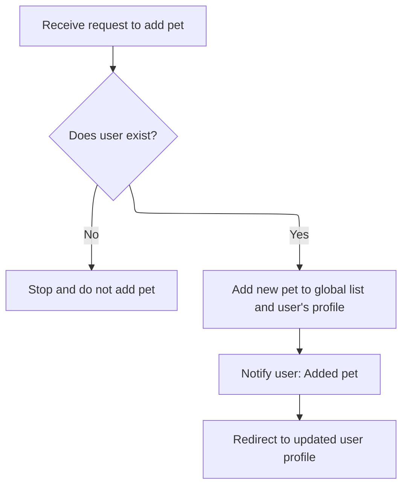
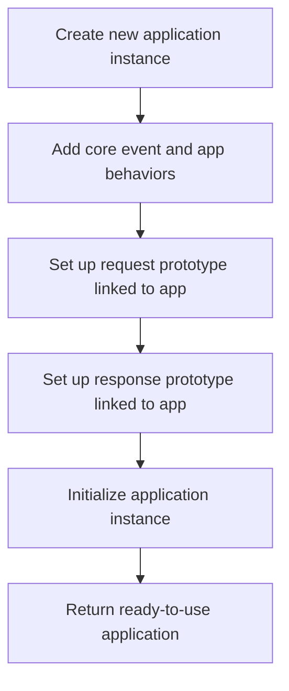
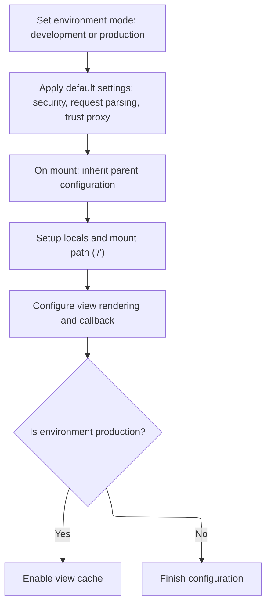

This document describes how a new application instance is created and configured to handle incoming HTTP requests, process user actions, and return responses. The flow covers preparing request and response objects, routing, initialization, and configuration to ensure the application is ready for use.

# Bootstrapping the app handler

<SwmSnippet path="/lib/express.js" line="36">

---

In <SwmToken path="lib/express.js" pos="36:2:2" line-data="function createApplication() {">`createApplication`</SwmToken>, we set up the app function to forward all requests to <SwmToken path="lib/express.js" pos="38:1:3" line-data="    app.handle(req, res, next);">`app.handle`</SwmToken>, so the next step is to define what handle actually does in <SwmPath>[lib/application.js](lib/application.js)</SwmPath>.

```javascript
function createApplication() {
  var app = function(req, res, next) {
    app.handle(req, res, next);
  };

```

---

</SwmSnippet>

## Preparing the request and response objects

<SwmSnippet path="/lib/application.js" line="152">

---

In <SwmToken path="lib/application.js" pos="152:2:2" line-data="app.handle = function handle(req, res, callback) {">`handle`</SwmToken>, we prep the request and response objects: set up headers, circular references, and prototype inheritance so they get app-specific methods. Next, we need to call the user-pet controller to actually process the route logic for this request.

```javascript
app.handle = function handle(req, res, callback) {
  // final handler
  var done = callback || finalhandler(req, res, {
    env: this.get('env'),
    onerror: logerror.bind(this)
  });

  // set powered by header
  if (this.enabled('x-powered-by')) {
    res.setHeader('X-Powered-By', 'Express');
  }

  // set circular references
  req.res = res;
  res.req = req;

  // alter the prototypes
  Object.setPrototypeOf(req, this.request)
  Object.setPrototypeOf(res, this.response)

  // setup locals
  if (!res.locals) {
    res.locals = Object.create(null);
  }

```

---

</SwmSnippet>

### Processing user-pet creation and redirect



<SwmSnippet path="/examples/mvc/controllers/user-pet/index.js" line="12">

---

<SwmToken path="examples/mvc/controllers/user-pet/index.js" pos="12:2:2" line-data="exports.create = function(req, res, next){">`create`</SwmToken> in the user-pet controller checks for a valid user, creates a pet, updates the db, and sets a message before redirecting. Next, we need <SwmPath>[lib/response.js](lib/response.js)</SwmPath> to actually perform the redirect and handle the response formatting.

```javascript
exports.create = function(req, res, next){
  var id = req.params.user_id;
  var user = db.users[id];
  var body = req.body;
  if (!user) return next('route');
  var pet = { name: body.pet.name };
  pet.id = db.pets.push(pet) - 1;
  user.pets.push(pet);
  res.message('Added pet ' + body.pet.name);
  res.redirect('/user/' + id);
};
```

---

</SwmSnippet>

<SwmSnippet path="/lib/response.js" line="819">

---

<SwmToken path="lib/response.js" pos="819:2:2" line-data="res.redirect = function redirect(url) {">`redirect`</SwmToken> in <SwmPath>[lib/response.js](lib/response.js)</SwmPath> sets up the Location header, picks the response format based on Accept headers, and ends the response. It also validates arguments and handles HEAD requests without a body.

```javascript
res.redirect = function redirect(url) {
  var address = url;
  var body;
  var status = 302;

  // allow status / url
  if (arguments.length === 2) {
    status = arguments[0]
    address = arguments[1]
  }

  if (!address) {
    deprecate('Provide a url argument');
  }

  if (typeof address !== 'string') {
    deprecate('Url must be a string');
  }

  if (typeof status !== 'number') {
    deprecate('Status must be a number');
  }

  // Set location header
  address = this.location(address).get('Location');

  // Support text/{plain,html} by default
  this.format({
    text: function(){
      body = statuses.message[status] + '. Redirecting to ' + address
    },

    html: function(){
      var u = escapeHtml(address);
      body = '<p>' + statuses.message[status] + '. Redirecting to ' + u + '</p>'
    },

    default: function(){
      body = '';
    }
  });

  // Respond
  this.status(status);
  this.set('Content-Length', Buffer.byteLength(body));

  if (this.req.method === 'HEAD') {
    this.end();
  } else {
    this.end(body);
  }
};
```

---

</SwmSnippet>

### Routing the request

<SwmSnippet path="/lib/application.js" line="177">

---

After returning from the user-pet controller, <SwmToken path="lib/application.js" pos="177:5:5" line-data="  this.router.handle(req, res, done);">`handle`</SwmToken> in <SwmPath>[lib/application.js](lib/application.js)</SwmPath> passes control to the router, so any remaining middleware or error handlers can run.

```javascript
  this.router.handle(req, res, done);
};
```

---

</SwmSnippet>

## Mixing in app features and initializing



<SwmSnippet path="/lib/express.js" line="41">

---

After returning from <SwmPath>[lib/application.js](lib/application.js)</SwmPath>, <SwmToken path="lib/express.js" pos="36:2:2" line-data="function createApplication() {">`createApplication`</SwmToken> mixes in event and proto methods, sets up request/response inheritance, calls <SwmToken path="lib/express.js" pos="54:1:3" line-data="  app.init();">`app.init`</SwmToken> to set up internal state, and then returns the app.

```javascript
  mixin(app, EventEmitter.prototype, false);
  mixin(app, proto, false);

  // expose the prototype that will get set on requests
  app.request = Object.create(req, {
    app: { configurable: true, enumerable: true, writable: true, value: app }
  })

  // expose the prototype that will get set on responses
  app.response = Object.create(res, {
    app: { configurable: true, enumerable: true, writable: true, value: app }
  })

  app.init();
  return app;
}
```

---

</SwmSnippet>

# Setting up app internals

<SwmSnippet path="/lib/application.js" line="59">

---

In <SwmToken path="lib/application.js" pos="59:2:2" line-data="app.init = function init() {">`init`</SwmToken>, we set up empty objects for cache, engines, and settings so the app has its own internal storage. Next, we call the user-pet controller to handle route logic.

```javascript
app.init = function init() {
  var router = null;

  this.cache = Object.create(null);
  this.engines = Object.create(null);
  this.settings = Object.create(null);

```

---

</SwmSnippet>

<SwmSnippet path="/lib/application.js" line="66">

---

After returning from the user-pet controller, <SwmToken path="lib/express.js" pos="54:3:3" line-data="  app.init();">`init`</SwmToken> in <SwmPath>[lib/application.js](lib/application.js)</SwmPath> calls <SwmToken path="lib/application.js" pos="66:3:3" line-data="  this.defaultConfiguration();">`defaultConfiguration`</SwmToken> to set up all the app's default settings and listeners.

```javascript
  this.defaultConfiguration();

```

---

</SwmSnippet>

## Configuring app defaults and inheritance



<SwmSnippet path="/lib/application.js" line="90">

---

In <SwmToken path="lib/application.js" pos="90:2:2" line-data="app.defaultConfiguration = function defaultConfiguration() {">`defaultConfiguration`</SwmToken>, we set up default settings, trust proxy management, and prototype inheritance for modular app composition. Next, we call the user-pet controller for route logic.

```javascript
app.defaultConfiguration = function defaultConfiguration() {
  var env = process.env.NODE_ENV || 'development';

  // default settings
  this.enable('x-powered-by');
  this.set('etag', 'weak');
  this.set('env', env);
  this.set('query parser', 'simple')
  this.set('subdomain offset', 2);
  this.set('trust proxy', false);

  // trust proxy inherit back-compat
  Object.defineProperty(this.settings, trustProxyDefaultSymbol, {
    configurable: true,
    value: true
  });

  debug('booting in %s mode', env);

  this.on('mount', function onmount(parent) {
    // inherit trust proxy
    if (this.settings[trustProxyDefaultSymbol] === true
      && typeof parent.settings['trust proxy fn'] === 'function') {
      delete this.settings['trust proxy'];
      delete this.settings['trust proxy fn'];
    }

    // inherit protos
    Object.setPrototypeOf(this.request, parent.request)
    Object.setPrototypeOf(this.response, parent.response)
    Object.setPrototypeOf(this.engines, parent.engines)
    Object.setPrototypeOf(this.settings, parent.settings)
  });

  // setup locals
  this.locals = Object.create(null);

```

---

</SwmSnippet>

<SwmSnippet path="/lib/application.js" line="127">

---

After returning from the user-pet controller, <SwmToken path="lib/application.js" pos="66:3:3" line-data="  this.defaultConfiguration();">`defaultConfiguration`</SwmToken> in <SwmPath>[lib/application.js](lib/application.js)</SwmPath> finishes setting up mount path, locals, view settings, and enables view cache only in production.

```javascript
  // top-most app is mounted at /
  this.mountpath = '/';

  // default locals
  this.locals.settings = this.settings;

  // default configuration
  this.set('view', View);
  this.set('views', resolve('views'));
  this.set('jsonp callback name', 'callback');

  if (env === 'production') {
    this.enable('view cache');
  }
};
```

---

</SwmSnippet>

## Lazy router setup

<SwmSnippet path="/lib/application.js" line="68">

---

After returning from <SwmPath>[lib/application.js](lib/application.js)</SwmPath>, <SwmToken path="lib/express.js" pos="54:3:3" line-data="  app.init();">`init`</SwmToken> sets up the router property so it's only created when first accessed, keeping resource usage minimal until needed.

```javascript
  // Setup getting to lazily add base router
  Object.defineProperty(this, 'router', {
    configurable: true,
    enumerable: true,
    get: function getrouter() {
      if (router === null) {
        router = new Router({
          caseSensitive: this.enabled('case sensitive routing'),
          strict: this.enabled('strict routing')
        });
      }

      return router;
    }
  });
};
```

---

</SwmSnippet>

&nbsp;

*This is an auto-generated document by Swimm 🌊 and has not yet been verified by a human*

<SwmMeta version="3.0.0" repo-id="Z2l0aHViJTNBJTNBSmF2YVNjcmlwdEV4cHJlc3MlM0ElM0FHb3BpbmF0aHJlZGR5NjY=" repo-name="JavaScriptExpress"><sup>Powered by [Swimm](https://app.swimm.io/)</sup></SwmMeta>
