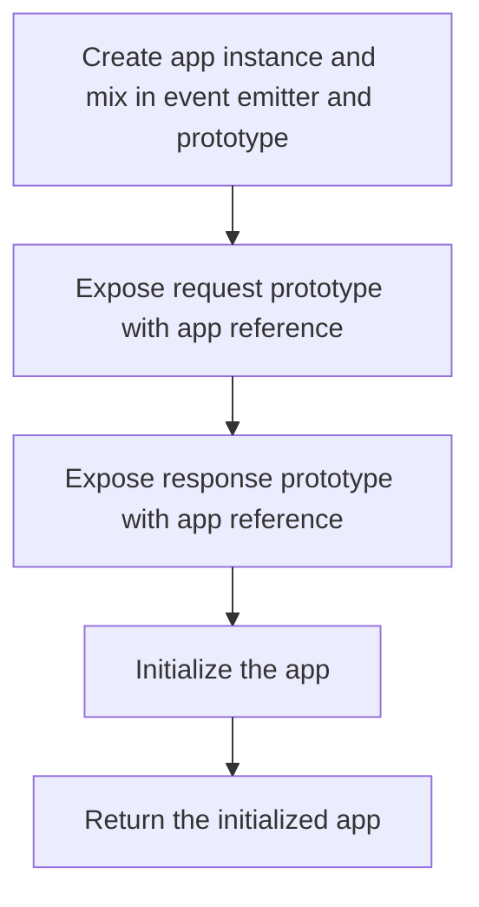
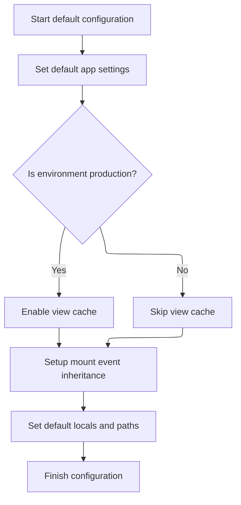

This document explains the flow of creating and initializing an Express application instance. The flow receives HTTP requests as input and returns a fully initialized application instance capable of handling these requests. The initialization process sets up request and response prototypes linked to the app, applies default settings, and prepares the app to process incoming requests efficiently.

# Creating the Express Application Function

<SwmSnippet path="/lib/express.js" line="36">

---

Here we start by creating the app as a function that handles requests by calling <SwmToken path="lib/express.js" pos="38:1:3" line-data="    app.handle(req, res, next);">`app.handle`</SwmToken>. Then, it mixes in <SwmToken path="lib/express.js" pos="41:6:6" line-data="  mixin(app, EventEmitter.prototype, false);">`EventEmitter`</SwmToken> and proto properties, making the app callable and able to emit events with extra methods.

```javascript
function createApplication() {
  var app = function(req, res, next) {
    app.handle(req, res, next);
  };

```

---

</SwmSnippet>

## Handling Requests and Setting Up Request/Response

```mermaid
%%{init: {"flowchart": {"defaultRenderer": "elk"}} }%%
flowchart TD
    node1["Start handle function"] --> node2{"Is callback provided?"}
    click node1 openCode "lib/application.js:152:153"
    node2 -->|"Yes"| node3["Use provided callback as done"]
    click node2 openCode "lib/application.js:154:154"
    node2 -->|"No"| node4["Create default final handler as done"]
    click node4 openCode "lib/application.js:154:157"
    node3 --> node5{"Is x-powered-by enabled?"}
    click node3 openCode "lib/application.js:160:161"
    node4 --> node5
    node5 -->|"Yes"| node6["Set X-Powered-By header"]
    click node5 openCode "lib/application.js:160:161"
    node5 -->|"No"| node8
    node6 --> node8
    click node6 openCode "lib/application.js:161:161"
    node8 --> node9["Link req and res objects"]
    click node8 openCode "lib/application.js:165:166"
    node9 --> node10["Alter prototypes of req and res"]
    click node9 openCode "lib/application.js:169:170"
    node10 --> node11{"Does res.locals exist?"}
    click node10 openCode "lib/application.js:173:174"
    node11 -->|"No"| node12["Initialize res.locals"]
    click node11 openCode "lib/application.js:173:175"
    node11 -->|"Yes"| node13
    node12 --> node13
    node13 --> node14["Delegate to router.handle with done"]
    click node13 openCode "lib/application.js:177:177"
    node14 --> node15["End handle function"]
classDef HeadingStyle fill:#777777,stroke:#333,stroke-width:2px;

%% Swimm:
%% %%{init: {"flowchart": {"defaultRenderer": "elk"}} }%%
%% flowchart TD
%%     node1["Start handle function"] --> node2{"Is callback provided?"}
%%     click node1 openCode "<SwmPath>[lib/application.js](lib/application.js)</SwmPath>:152:153"
%%     node2 -->|"Yes"| node3["Use provided callback as done"]
%%     click node2 openCode "<SwmPath>[lib/application.js](lib/application.js)</SwmPath>:154:154"
%%     node2 -->|"No"| node4["Create default final handler as done"]
%%     click node4 openCode "<SwmPath>[lib/application.js](lib/application.js)</SwmPath>:154:157"
%%     node3 --> node5{"Is <SwmToken path="lib/application.js" pos="94:6:10" line-data="  this.enable(&#39;x-powered-by&#39;);">`x-powered-by`</SwmToken> enabled?"}
%%     click node3 openCode "<SwmPath>[lib/application.js](lib/application.js)</SwmPath>:160:161"
%%     node4 --> node5
%%     node5 -->|"Yes"| node6["Set <SwmToken path="lib/application.js" pos="161:6:10" line-data="    res.setHeader(&#39;X-Powered-By&#39;, &#39;Express&#39;);">`X-Powered-By`</SwmToken> header"]
%%     click node5 openCode "<SwmPath>[lib/application.js](lib/application.js)</SwmPath>:160:161"
%%     node5 -->|"No"| node8
%%     node6 --> node8
%%     click node6 openCode "<SwmPath>[lib/application.js](lib/application.js)</SwmPath>:161:161"
%%     node8 --> node9["Link req and res objects"]
%%     click node8 openCode "<SwmPath>[lib/application.js](lib/application.js)</SwmPath>:165:166"
%%     node9 --> node10["Alter prototypes of req and res"]
%%     click node9 openCode "<SwmPath>[lib/application.js](lib/application.js)</SwmPath>:169:170"
%%     node10 --> node11{"Does <SwmToken path="lib/application.js" pos="173:5:7" line-data="  if (!res.locals) {">`res.locals`</SwmToken> exist?"}
%%     click node10 openCode "<SwmPath>[lib/application.js](lib/application.js)</SwmPath>:173:174"
%%     node11 -->|"No"| node12["Initialize <SwmToken path="lib/application.js" pos="173:5:7" line-data="  if (!res.locals) {">`res.locals`</SwmToken>"]
%%     click node11 openCode "<SwmPath>[lib/application.js](lib/application.js)</SwmPath>:173:175"
%%     node11 -->|"Yes"| node13
%%     node12 --> node13
%%     node13 --> node14["Delegate to <SwmToken path="lib/application.js" pos="177:3:5" line-data="  this.router.handle(req, res, done);">`router.handle`</SwmToken> with done"]
%%     click node13 openCode "<SwmPath>[lib/application.js](lib/application.js)</SwmPath>:177:177"
%%     node14 --> node15["End handle function"]
%% classDef HeadingStyle fill:#777777,stroke:#333,stroke-width:2px;
```



<SwmSnippet path="/lib/application.js" line="152">

---

In handle we set up the environment and error handling, add the <SwmToken path="lib/application.js" pos="161:6:10" line-data="    res.setHeader(&#39;X-Powered-By&#39;, &#39;Express&#39;);">`X-Powered-By`</SwmToken> header if enabled, link req and res circularly, alter their prototypes to app-specific ones, and initialize <SwmToken path="lib/application.js" pos="173:5:7" line-data="  if (!res.locals) {">`res.locals`</SwmToken> for passing data through middleware.

```javascript
app.handle = function handle(req, res, callback) {
  // final handler
  var done = callback || finalhandler(req, res, {
    env: this.get('env'),
    onerror: logerror.bind(this)
  });

  // set powered by header
  if (this.enabled('x-powered-by')) {
    res.setHeader('X-Powered-By', 'Express');
  }

  // set circular references
  req.res = res;
  res.req = req;

  // alter the prototypes
  Object.setPrototypeOf(req, this.request)
  Object.setPrototypeOf(res, this.response)

  // setup locals
  if (!res.locals) {
    res.locals = Object.create(null);
  }

```

---

</SwmSnippet>

<SwmSnippet path="/examples/mvc/controllers/user-pet/index.js" line="12">

---

<SwmToken path="examples/mvc/controllers/user-pet/index.js" pos="12:2:2" line-data="exports.create = function(req, res, next){">`create`</SwmToken> extracts the user ID from <SwmToken path="examples/mvc/controllers/user-pet/index.js" pos="13:7:9" line-data="  var id = req.params.user_id;">`req.params`</SwmToken>, fetches the user from db, and if missing, skips the route. It creates a pet with the name from <SwmToken path="examples/mvc/controllers/user-pet/index.js" pos="15:7:9" line-data="  var body = req.body;">`req.body`</SwmToken>, assigns an ID by pushing to <SwmToken path="examples/mvc/controllers/user-pet/index.js" pos="18:7:9" line-data="  pet.id = db.pets.push(pet) - 1;">`db.pets`</SwmToken>, adds the pet to the user's pets array, sends a message, and redirects.

```javascript
exports.create = function(req, res, next){
  var id = req.params.user_id;
  var user = db.users[id];
  var body = req.body;
  if (!user) return next('route');
  var pet = { name: body.pet.name };
  pet.id = db.pets.push(pet) - 1;
  user.pets.push(pet);
  res.message('Added pet ' + body.pet.name);
  res.redirect('/user/' + id);
};
```

---

</SwmSnippet>

<SwmSnippet path="/lib/application.js" line="177">

---

After setting up req and res, handle delegates the request to <SwmToken path="lib/application.js" pos="177:1:5" line-data="  this.router.handle(req, res, done);">`this.router.handle`</SwmToken> with the final callback, letting the router manage routing and middleware.

```javascript
  this.router.handle(req, res, done);
};
```

---

</SwmSnippet>

## Finalizing the Application Setup



<SwmSnippet path="/lib/express.js" line="41">

---

After returning from handle, <SwmToken path="lib/express.js" pos="36:2:2" line-data="function createApplication() {">`createApplication`</SwmToken> sets up <SwmToken path="lib/express.js" pos="45:1:3" line-data="  app.request = Object.create(req, {">`app.request`</SwmToken> and <SwmToken path="lib/express.js" pos="50:1:3" line-data="  app.response = Object.create(res, {">`app.response`</SwmToken> prototypes linked to the app, mixes in event and proto methods, calls <SwmToken path="lib/express.js" pos="54:1:3" line-data="  app.init();">`app.init`</SwmToken> to initialize, and returns the app function.

```javascript
  mixin(app, EventEmitter.prototype, false);
  mixin(app, proto, false);

  // expose the prototype that will get set on requests
  app.request = Object.create(req, {
    app: { configurable: true, enumerable: true, writable: true, value: app }
  })

  // expose the prototype that will get set on responses
  app.response = Object.create(res, {
    app: { configurable: true, enumerable: true, writable: true, value: app }
  })

  app.init();
  return app;
}
```

---

</SwmSnippet>

# Initializing Application State

<SwmSnippet path="/lib/application.js" line="59">

---

In init we create empty objects for cache, engines, and settings to prepare the app for configuration and runtime data.

```javascript
app.init = function init() {
  var router = null;

  this.cache = Object.create(null);
  this.engines = Object.create(null);
  this.settings = Object.create(null);

```

---

</SwmSnippet>

<SwmSnippet path="/lib/application.js" line="66">

---

After setting up empty objects, init calls <SwmToken path="lib/application.js" pos="66:3:3" line-data="  this.defaultConfiguration();">`defaultConfiguration`</SwmToken> to apply default settings and event handlers.

```javascript
  this.defaultConfiguration();

```

---

</SwmSnippet>

## Applying Default Settings



<SwmSnippet path="/lib/application.js" line="90">

---

In <SwmToken path="lib/application.js" pos="90:2:2" line-data="app.defaultConfiguration = function defaultConfiguration() {">`defaultConfiguration`</SwmToken> we set environment, headers, query parser, and proxy settings. We also handle mounting to inherit settings and prototypes from parent apps, and set up locals and views.

```javascript
app.defaultConfiguration = function defaultConfiguration() {
  var env = process.env.NODE_ENV || 'development';

  // default settings
  this.enable('x-powered-by');
  this.set('etag', 'weak');
  this.set('env', env);
  this.set('query parser', 'simple')
  this.set('subdomain offset', 2);
  this.set('trust proxy', false);

  // trust proxy inherit back-compat
  Object.defineProperty(this.settings, trustProxyDefaultSymbol, {
    configurable: true,
    value: true
  });

  debug('booting in %s mode', env);

  this.on('mount', function onmount(parent) {
    // inherit trust proxy
    if (this.settings[trustProxyDefaultSymbol] === true
      && typeof parent.settings['trust proxy fn'] === 'function') {
      delete this.settings['trust proxy'];
      delete this.settings['trust proxy fn'];
    }

    // inherit protos
    Object.setPrototypeOf(this.request, parent.request)
    Object.setPrototypeOf(this.response, parent.response)
    Object.setPrototypeOf(this.engines, parent.engines)
    Object.setPrototypeOf(this.settings, parent.settings)
  });

  // setup locals
  this.locals = Object.create(null);

```

---

</SwmSnippet>

<SwmSnippet path="/lib/application.js" line="127">

---

At the end of <SwmToken path="lib/application.js" pos="66:3:3" line-data="  this.defaultConfiguration();">`defaultConfiguration`</SwmToken> we set mount path, default locals including settings, view engine, views path, JSONP callback name, and enable view cache in production.

```javascript
  // top-most app is mounted at /
  this.mountpath = '/';

  // default locals
  this.locals.settings = this.settings;

  // default configuration
  this.set('view', View);
  this.set('views', resolve('views'));
  this.set('jsonp callback name', 'callback');

  if (env === 'production') {
    this.enable('view cache');
  }
};
```

---

</SwmSnippet>

## Lazy Router Setup

<SwmSnippet path="/lib/application.js" line="68">

---

In init we define a getter for router that creates it lazily with case sensitivity and strict routing options based on app settings.

```javascript
  // Setup getting to lazily add base router
  Object.defineProperty(this, 'router', {
    configurable: true,
    enumerable: true,
    get: function getrouter() {
      if (router === null) {
        router = new Router({
          caseSensitive: this.enabled('case sensitive routing'),
          strict: this.enabled('strict routing')
        });
      }

      return router;
    }
  });
};
```

---

</SwmSnippet>

&nbsp;

*This is an auto-generated document by Swimm 🌊 and has not yet been verified by a human*

<SwmMeta version="3.0.0" repo-id="Z2l0aHViJTNBJTNBSmF2YVNjcmlwdEV4cHJlc3MlM0ElM0FHb3BpbmF0aHJlZGR5NjY=" repo-name="JavaScriptExpress"><sup>Powered by [Swimm](https://app.swimm.io/)</sup></SwmMeta>
