This document describes the flow for preparing and delivering HTTP responses to clients. It covers determining the response format, setting headers, negotiating content types, and handling special status codes to ensure clients receive properly formatted responses.

# Where is this flow used?

This flow is used multiple times in the codebase as represented in the following diagram:

(Note - these are only some of the entry points of this flow)

```mermaid
graph TD;
      fd1728f50ca77b1bb53b0685e295489e34318f940f5d55399f2e33f5c92717f2(index.js::resource) --> 98febe000f2b1346047c1c08176b123c8d6ba0b2b1e354f69eaa10c67a9117f9(index.js::destroy)

fd1728f50ca77b1bb53b0685e295489e34318f940f5d55399f2e33f5c92717f2(index.js::resource) --> 629be14bd8f1c029160cc911265b95632d90e6e16b6c2c241bd83c906efa3d4a(index.js::range)

fd1728f50ca77b1bb53b0685e295489e34318f940f5d55399f2e33f5c92717f2(index.js::resource) --> a2f3353ebb51d3002697aeae038ead4bbc44fc2ef18a4c2793b9a85bc2e907f0(index.js::delete)

98febe000f2b1346047c1c08176b123c8d6ba0b2b1e354f69eaa10c67a9117f9(index.js::destroy) --> a7389254cc2ab8739577ac1cfda594df520d8c686b1b9d1b51a24bd0e414a9fa(lib/response.js::send):::mainFlowStyle

629be14bd8f1c029160cc911265b95632d90e6e16b6c2c241bd83c906efa3d4a(index.js::range) --> a7389254cc2ab8739577ac1cfda594df520d8c686b1b9d1b51a24bd0e414a9fa(lib/response.js::send):::mainFlowStyle

a2f3353ebb51d3002697aeae038ead4bbc44fc2ef18a4c2793b9a85bc2e907f0(index.js::delete) --> a7389254cc2ab8739577ac1cfda594df520d8c686b1b9d1b51a24bd0e414a9fa(lib/response.js::send):::mainFlowStyle

a4ea6a802a6702c9a017c94a38ddeb3f5f6646435dd66cb1d38cfe856bfae357(index.js::default) --> a7389254cc2ab8739577ac1cfda594df520d8c686b1b9d1b51a24bd0e414a9fa(lib/response.js::send):::mainFlowStyle

5940cb1da7065c64ceb47308c662b707ea87c1cfbcf36d8253e57e9f6c205da9(lib/response.js::download) --> b4538e23c2b7fb595b7154f30f896eb5c6537aba90035366a33f48066298cd2e(lib/response.js::sendFile)

b4538e23c2b7fb595b7154f30f896eb5c6537aba90035366a33f48066298cd2e(lib/response.js::sendFile) --> a7389254cc2ab8739577ac1cfda594df520d8c686b1b9d1b51a24bd0e414a9fa(lib/response.js::send):::mainFlowStyle

e1e9823138e4f483cbe498b3d51bb7774085a371b14be32fd86f825e4321f69b(index.js::json) --> 9dbeb9333bebbf6cf418c38d8abb37abda14ec56ab794155129aec8a55c618e7(lib/response.js::json):::mainFlowStyle

9dbeb9333bebbf6cf418c38d8abb37abda14ec56ab794155129aec8a55c618e7(lib/response.js::json):::mainFlowStyle --> a7389254cc2ab8739577ac1cfda594df520d8c686b1b9d1b51a24bd0e414a9fa(lib/response.js::send):::mainFlowStyle

0fe15ac3cc827a1cf2082524bb62add58d695586a5f6fc9916d7b3284d6c0a0e(lib/response.js::jsonp) --> a7389254cc2ab8739577ac1cfda594df520d8c686b1b9d1b51a24bd0e414a9fa(lib/response.js::send):::mainFlowStyle


classDef mainFlowStyle color:#000000,fill:#7CB9F4
classDef rootsStyle color:#000000,fill:#00FFF4
classDef Style1 color:#000000,fill:#00FFAA
classDef Style2 color:#000000,fill:#FFFF00
classDef Style3 color:#000000,fill:#AA7CB9

%% Swimm:
%% graph TD;
%%       fd1728f50ca77b1bb53b0685e295489e34318f940f5d55399f2e33f5c92717f2(<SwmPath>[index.js](index.js)</SwmPath>::resource) --> 98febe000f2b1346047c1c08176b123c8d6ba0b2b1e354f69eaa10c67a9117f9(<SwmPath>[index.js](index.js)</SwmPath>::destroy)
%% 
%% fd1728f50ca77b1bb53b0685e295489e34318f940f5d55399f2e33f5c92717f2(<SwmPath>[index.js](index.js)</SwmPath>::resource) --> 629be14bd8f1c029160cc911265b95632d90e6e16b6c2c241bd83c906efa3d4a(<SwmPath>[index.js](index.js)</SwmPath>::range)
%% 
%% fd1728f50ca77b1bb53b0685e295489e34318f940f5d55399f2e33f5c92717f2(<SwmPath>[index.js](index.js)</SwmPath>::resource) --> a2f3353ebb51d3002697aeae038ead4bbc44fc2ef18a4c2793b9a85bc2e907f0(<SwmPath>[index.js](index.js)</SwmPath>::delete)
%% 
%% 98febe000f2b1346047c1c08176b123c8d6ba0b2b1e354f69eaa10c67a9117f9(<SwmPath>[index.js](index.js)</SwmPath>::destroy) --> a7389254cc2ab8739577ac1cfda594df520d8c686b1b9d1b51a24bd0e414a9fa(<SwmPath>[lib/response.js](lib/response.js)</SwmPath>::send):::mainFlowStyle
%% 
%% 629be14bd8f1c029160cc911265b95632d90e6e16b6c2c241bd83c906efa3d4a(<SwmPath>[index.js](index.js)</SwmPath>::range) --> a7389254cc2ab8739577ac1cfda594df520d8c686b1b9d1b51a24bd0e414a9fa(<SwmPath>[lib/response.js](lib/response.js)</SwmPath>::send):::mainFlowStyle
%% 
%% a2f3353ebb51d3002697aeae038ead4bbc44fc2ef18a4c2793b9a85bc2e907f0(<SwmPath>[index.js](index.js)</SwmPath>::delete) --> a7389254cc2ab8739577ac1cfda594df520d8c686b1b9d1b51a24bd0e414a9fa(<SwmPath>[lib/response.js](lib/response.js)</SwmPath>::send):::mainFlowStyle
%% 
%% a4ea6a802a6702c9a017c94a38ddeb3f5f6646435dd66cb1d38cfe856bfae357(<SwmPath>[index.js](index.js)</SwmPath>::default) --> a7389254cc2ab8739577ac1cfda594df520d8c686b1b9d1b51a24bd0e414a9fa(<SwmPath>[lib/response.js](lib/response.js)</SwmPath>::send):::mainFlowStyle
%% 
%% 5940cb1da7065c64ceb47308c662b707ea87c1cfbcf36d8253e57e9f6c205da9(<SwmPath>[lib/response.js](lib/response.js)</SwmPath>::download) --> b4538e23c2b7fb595b7154f30f896eb5c6537aba90035366a33f48066298cd2e(<SwmPath>[lib/response.js](lib/response.js)</SwmPath>::<SwmToken path="lib/response.js" pos="357:16:16" line-data=" *  The following example illustrates how `res.sendFile()` may">`sendFile`</SwmToken>)
%% 
%% b4538e23c2b7fb595b7154f30f896eb5c6537aba90035366a33f48066298cd2e(<SwmPath>[lib/response.js](lib/response.js)</SwmPath>::<SwmToken path="lib/response.js" pos="357:16:16" line-data=" *  The following example illustrates how `res.sendFile()` may">`sendFile`</SwmToken>) --> a7389254cc2ab8739577ac1cfda594df520d8c686b1b9d1b51a24bd0e414a9fa(<SwmPath>[lib/response.js](lib/response.js)</SwmPath>::send):::mainFlowStyle
%% 
%% e1e9823138e4f483cbe498b3d51bb7774085a371b14be32fd86f825e4321f69b(<SwmPath>[index.js](index.js)</SwmPath>::json) --> 9dbeb9333bebbf6cf418c38d8abb37abda14ec56ab794155129aec8a55c618e7(<SwmPath>[lib/response.js](lib/response.js)</SwmPath>::json):::mainFlowStyle
%% 
%% 9dbeb9333bebbf6cf418c38d8abb37abda14ec56ab794155129aec8a55c618e7(<SwmPath>[lib/response.js](lib/response.js)</SwmPath>::json):::mainFlowStyle --> a7389254cc2ab8739577ac1cfda594df520d8c686b1b9d1b51a24bd0e414a9fa(<SwmPath>[lib/response.js](lib/response.js)</SwmPath>::send):::mainFlowStyle
%% 
%% 0fe15ac3cc827a1cf2082524bb62add58d695586a5f6fc9916d7b3284d6c0a0e(<SwmPath>[lib/response.js](lib/response.js)</SwmPath>::jsonp) --> a7389254cc2ab8739577ac1cfda594df520d8c686b1b9d1b51a24bd0e414a9fa(<SwmPath>[lib/response.js](lib/response.js)</SwmPath>::send):::mainFlowStyle
%% 
%% 
%% classDef mainFlowStyle color:#000000,fill:#7CB9F4
%% classDef rootsStyle color:#000000,fill:#00FFF4
%% classDef Style1 color:#000000,fill:#00FFAA
%% classDef Style2 color:#000000,fill:#FFFF00
%% classDef Style3 color:#000000,fill:#AA7CB9
```

# Sending the response and determining content type

```mermaid
%%{init: {"flowchart": {"defaultRenderer": "elk"}} }%%
flowchart TD
  node1["Receive response body"] --> node2{"Type of body?"}
  click node1 openCode "lib/response.js:125:134"
  node2 -->|"ArrayBuffer view"| node3["Serializing and sending JSON responses"]
  
  node2 -->|"String"| node4["Updating Content-Type with charset"]
  
  node2 -->|"Other"| node5["Convert null to empty string"]
  click node5 openCode "lib/response.js:145:146"
  node3 --> node6["Set Content-Length, ETag, and check freshness"]
  node4 --> node6
  node5 --> node6
  click node6 openCode "lib/response.js:167:199"
  node6 --> node7{"Special status or HEAD?"}
  
  node7 -->|"204/304/205"| node8["Alter headers/body and end response"]
  click node8 openCode "lib/response.js:202:214"
  node7 -->|"HEAD"| node8
  node7 -->|"Else"| node8
  node8 --> node9["Return response"]
  click node9 openCode "lib/response.js:218:224"
classDef HeadingStyle fill:#777777,stroke:#333,stroke-width:2px;
click node3 goToHeading "Serializing and sending JSON responses"
node3:::HeadingStyle
click node4 goToHeading "Updating Content-Type with charset"
node4:::HeadingStyle
click node7 goToHeading "Setting the HTTP status code"
node7:::HeadingStyle

%% Swimm:
%% %%{init: {"flowchart": {"defaultRenderer": "elk"}} }%%
%% flowchart TD
%%   node1["Receive response body"] --> node2{"Type of body?"}
%%   click node1 openCode "<SwmPath>[lib/response.js](lib/response.js)</SwmPath>:125:134"
%%   node2 -->|"<SwmToken path="lib/response.js" pos="146:8:8" line-data="      } else if (ArrayBuffer.isView(chunk)) {">`ArrayBuffer`</SwmToken> view"| node3["Serializing and sending JSON responses"]
%%   
%%   node2 -->|"String"| node4["Updating <SwmToken path="lib/response.js" pos="137:10:12" line-data="      if (!this.get(&#39;Content-Type&#39;)) {">`Content-Type`</SwmToken> with charset"]
%%   
%%   node2 -->|"Other"| node5["Convert null to empty string"]
%%   click node5 openCode "<SwmPath>[lib/response.js](lib/response.js)</SwmPath>:145:146"
%%   node3 --> node6["Set <SwmToken path="lib/response.js" pos="171:5:7" line-data="  // populate Content-Length">`Content-Length`</SwmToken>, <SwmToken path="lib/response.js" pos="167:7:7" line-data="  // determine if ETag should be generated">`ETag`</SwmToken>, and check freshness"]
%%   node4 --> node6
%%   node5 --> node6
%%   click node6 openCode "<SwmPath>[lib/response.js](lib/response.js)</SwmPath>:167:199"
%%   node6 --> node7{"Special status or HEAD?"}
%%   
%%   node7 -->|"204/304/205"| node8["Alter headers/body and end response"]
%%   click node8 openCode "<SwmPath>[lib/response.js](lib/response.js)</SwmPath>:202:214"
%%   node7 -->|"HEAD"| node8
%%   node7 -->|"Else"| node8
%%   node8 --> node9["Return response"]
%%   click node9 openCode "<SwmPath>[lib/response.js](lib/response.js)</SwmPath>:218:224"
%% classDef HeadingStyle fill:#777777,stroke:#333,stroke-width:2px;
%% click node3 goToHeading "Serializing and sending JSON responses"
%% node3:::HeadingStyle
%% click node4 goToHeading "Updating <SwmToken path="lib/response.js" pos="137:10:12" line-data="      if (!this.get(&#39;Content-Type&#39;)) {">`Content-Type`</SwmToken> with charset"
%% node4:::HeadingStyle
%% click node7 goToHeading "Setting the HTTP status code"
%% node7:::HeadingStyle
```

<SwmSnippet path="/lib/response.js" line="125">

---

In <SwmToken path="lib/response.js" pos="125:2:2" line-data="res.send = function send(body) {">`send`</SwmToken>, we start by figuring out what kind of data we're sending (string, boolean, number, object, etc). If it's a string and there's no <SwmToken path="lib/response.js" pos="137:10:12" line-data="      if (!this.get(&#39;Content-Type&#39;)) {">`Content-Type`</SwmToken> header, we call <SwmToken path="lib/response.js" pos="138:3:8" line-data="        this.type(&#39;html&#39;);">`type('html')`</SwmToken> to set it. For <SwmToken path="lib/response.js" pos="146:8:8" line-data="      } else if (ArrayBuffer.isView(chunk)) {">`ArrayBuffer`</SwmToken> views, we call <SwmToken path="lib/response.js" pos="148:3:8" line-data="          this.type(&#39;bin&#39;);">`type('bin')`</SwmToken>. This makes sure the <SwmToken path="lib/response.js" pos="137:10:12" line-data="      if (!this.get(&#39;Content-Type&#39;)) {">`Content-Type`</SwmToken> header matches the actual response body, so clients know how to handle it.

```javascript
res.send = function send(body) {
  var chunk = body;
  var encoding;
  var req = this.req;
  var type;

  // settings
  var app = this.app;

  switch (typeof chunk) {
    // string defaulting to html
    case 'string':
      if (!this.get('Content-Type')) {
        this.type('html');
      }
      break;
    case 'boolean':
    case 'number':
    case 'object':
      if (chunk === null) {
        chunk = '';
      } else if (ArrayBuffer.isView(chunk)) {
        if (!this.get('Content-Type')) {
          this.type('bin');
        }
      } else {
```

---

</SwmSnippet>

<SwmSnippet path="/lib/response.js" line="511">

---

<SwmToken path="lib/response.js" pos="511:2:2" line-data="res.type = function contentType(type) {">`type`</SwmToken> figures out the right <SwmToken path="lib/response.js" pos="516:8:10" line-data="  return this.set(&#39;Content-Type&#39;, ct);">`Content-Type`</SwmToken> header for the response. If you pass a shorthand like 'html', it uses <SwmToken path="lib/response.js" pos="513:4:6" line-data="    ? (mime.contentType(type) || &#39;application/octet-stream&#39;)">`mime.contentType`</SwmToken> to get the full MIME type, and if that fails, it defaults to <SwmToken path="lib/response.js" pos="513:14:18" line-data="    ? (mime.contentType(type) || &#39;application/octet-stream&#39;)">`application/octet-stream`</SwmToken>. Then it sets the header so the client knows what kind of data it's getting.

```javascript
res.type = function contentType(type) {
  var ct = type.indexOf('/') === -1
    ? (mime.contentType(type) || 'application/octet-stream')
    : type;

  return this.set('Content-Type', ct);
};
```

---

</SwmSnippet>

<SwmSnippet path="/lib/response.js" line="151">

---

Back in <SwmToken path="lib/response.js" pos="125:2:2" line-data="res.send = function send(body) {">`send`</SwmToken>, after setting the <SwmToken path="lib/response.js" pos="137:10:12" line-data="      if (!this.get(&#39;Content-Type&#39;)) {">`Content-Type`</SwmToken>, if the chunk is an object (and not a Buffer or <SwmToken path="lib/response.js" pos="146:8:8" line-data="      } else if (ArrayBuffer.isView(chunk)) {">`ArrayBuffer`</SwmToken> view), we jump to <SwmToken path="lib/response.js" pos="151:5:5" line-data="        return this.json(chunk);">`json`</SwmToken> to serialize it and set the right headers. This makes sure objects are sent as JSON, not as plain text or binary.

```javascript
        return this.json(chunk);
      }
      break;
  }

```

---

</SwmSnippet>

## Serializing and sending JSON responses

```mermaid
%%{init: {"flowchart": {"defaultRenderer": "elk"}} }%%
flowchart TD
  node1["Retrieve JSON formatting and security settings (escape, replacer, spaces)"]
  click node1 openCode "lib/response.js:240:244"
  node1 --> node2{"Should special characters be escaped for security?"}
  click node2 openCode "lib/response.js:245:245"
  node2 -->|"Yes"| node3["Transform object to escaped JSON string with formatting"]
  click node3 openCode "lib/response.js:245:245"
  node2 -->|"No"| node4["Transform object to regular JSON string with formatting"]
  click node4 openCode "lib/response.js:245:245"
  node3 --> node5{"Is Content-Type header set?"}
  click node5 openCode "lib/response.js:248:249"
  node4 --> node5
  node5 -->|"No"| node6["Set Content-Type to application/json"]
  click node6 openCode "lib/response.js:249:250"
  node5 -->|"Yes"| node7["Send JSON response"]
  click node7 openCode "lib/response.js:252:252"
  node6 --> node7
classDef HeadingStyle fill:#777777,stroke:#333,stroke-width:2px;

%% Swimm:
%% %%{init: {"flowchart": {"defaultRenderer": "elk"}} }%%
%% flowchart TD
%%   node1["Retrieve JSON formatting and security settings (escape, replacer, spaces)"]
%%   click node1 openCode "<SwmPath>[lib/response.js](lib/response.js)</SwmPath>:240:244"
%%   node1 --> node2{"Should special characters be escaped for security?"}
%%   click node2 openCode "<SwmPath>[lib/response.js](lib/response.js)</SwmPath>:245:245"
%%   node2 -->|"Yes"| node3["Transform object to escaped JSON string with formatting"]
%%   click node3 openCode "<SwmPath>[lib/response.js](lib/response.js)</SwmPath>:245:245"
%%   node2 -->|"No"| node4["Transform object to regular JSON string with formatting"]
%%   click node4 openCode "<SwmPath>[lib/response.js](lib/response.js)</SwmPath>:245:245"
%%   node3 --> node5{"Is <SwmToken path="lib/response.js" pos="137:10:12" line-data="      if (!this.get(&#39;Content-Type&#39;)) {">`Content-Type`</SwmToken> header set?"}
%%   click node5 openCode "<SwmPath>[lib/response.js](lib/response.js)</SwmPath>:248:249"
%%   node4 --> node5
%%   node5 -->|"No"| node6["Set <SwmToken path="lib/response.js" pos="137:10:12" line-data="      if (!this.get(&#39;Content-Type&#39;)) {">`Content-Type`</SwmToken> to <SwmToken path="lib/response.js" pos="249:13:15" line-data="    this.set(&#39;Content-Type&#39;, &#39;application/json&#39;);">`application/json`</SwmToken>"]
%%   click node6 openCode "<SwmPath>[lib/response.js](lib/response.js)</SwmPath>:249:250"
%%   node5 -->|"Yes"| node7["Send JSON response"]
%%   click node7 openCode "<SwmPath>[lib/response.js](lib/response.js)</SwmPath>:252:252"
%%   node6 --> node7
%% classDef HeadingStyle fill:#777777,stroke:#333,stroke-width:2px;
```

<SwmSnippet path="/lib/response.js" line="239">

---

In <SwmToken path="lib/response.js" pos="239:2:2" line-data="res.json = function json(obj) {">`json`</SwmToken>, we grab app settings for escaping, replacer, and spaces, then call <SwmToken path="lib/response.js" pos="245:7:7" line-data="  var body = stringify(obj, replacer, spaces, escape)">`stringify`</SwmToken> to turn the object into a JSON string using those options. This lets us tweak the output for things like pretty-printing or escaping HTML-sensitive characters.

```javascript
res.json = function json(obj) {
  // settings
  var app = this.app;
  var escape = app.get('json escape')
  var replacer = app.get('json replacer');
  var spaces = app.get('json spaces');
  var body = stringify(obj, replacer, spaces, escape)

```

---

</SwmSnippet>

<SwmSnippet path="/lib/response.js" line="1029">

---

<SwmToken path="lib/response.js" pos="1029:2:2" line-data="function stringify (value, replacer, spaces, escape) {">`stringify`</SwmToken> turns the object into a JSON string, optionally escaping '<', '>', and '&' for safety in HTML contexts. It also decides whether to use replacer and spaces for pretty-printing based on the arguments, which helps with V8 performance.

```javascript
function stringify (value, replacer, spaces, escape) {
  // v8 checks arguments.length for optimizing simple call
  // https://bugs.chromium.org/p/v8/issues/detail?id=4730
  var json = replacer || spaces
    ? JSON.stringify(value, replacer, spaces)
    : JSON.stringify(value);

  if (escape && typeof json === 'string') {
    json = json.replace(/[<>&]/g, function (c) {
      switch (c.charCodeAt(0)) {
        case 0x3c:
          return '\\u003c'
        case 0x3e:
          return '\\u003e'
        case 0x26:
          return '\\u0026'
        /* istanbul ignore next: unreachable default */
        default:
          return c
      }
    })
  }

  return json
}
```

---

</SwmSnippet>

<SwmSnippet path="/lib/response.js" line="247">

---

After stringifying the object in <SwmToken path="lib/response.js" pos="249:15:15" line-data="    this.set(&#39;Content-Type&#39;, &#39;application/json&#39;);">`json`</SwmToken>, we check if <SwmToken path="lib/response.js" pos="248:10:12" line-data="  if (!this.get(&#39;Content-Type&#39;)) {">`Content-Type`</SwmToken> is set. If not, we set it to <SwmToken path="lib/response.js" pos="249:13:15" line-data="    this.set(&#39;Content-Type&#39;, &#39;application/json&#39;);">`application/json`</SwmToken>, then call <SwmToken path="lib/response.js" pos="252:5:5" line-data="  return this.send(body);">`send`</SwmToken> to actually send the JSON string to the client.

```javascript
  // content-type
  if (!this.get('Content-Type')) {
    this.set('Content-Type', 'application/json');
  }

  return this.send(body);
};
```

---

</SwmSnippet>

## Finalizing response encoding and charset

```mermaid
%%{init: {"flowchart": {"defaultRenderer": "elk"}} }%%
flowchart TD
  node1{"Is response content a string?"}
  click node1 openCode "lib/response.js:157:165"
  node1 -->|"Yes"| node2{"Is Content-Type header set?"}
  click node2 openCode "lib/response.js:159:163"
  node2 -->|"Yes"| node3["Update Content-Type header to include UTF-8 charset and send as UTF-8"]
  click node3 openCode "lib/response.js:163:164"
  node2 -->|"No"| node4["Send response as UTF-8 string"]
  click node4 openCode "lib/response.js:158:165"
  node1 -->|"No"| node5["Send response as-is"]
  click node5 openCode "lib/response.js:157:165"

classDef HeadingStyle fill:#777777,stroke:#333,stroke-width:2px;

%% Swimm:
%% %%{init: {"flowchart": {"defaultRenderer": "elk"}} }%%
%% flowchart TD
%%   node1{"Is response content a string?"}
%%   click node1 openCode "<SwmPath>[lib/response.js](lib/response.js)</SwmPath>:157:165"
%%   node1 -->|"Yes"| node2{"Is <SwmToken path="lib/response.js" pos="137:10:12" line-data="      if (!this.get(&#39;Content-Type&#39;)) {">`Content-Type`</SwmToken> header set?"}
%%   click node2 openCode "<SwmPath>[lib/response.js](lib/response.js)</SwmPath>:159:163"
%%   node2 -->|"Yes"| node3["Update <SwmToken path="lib/response.js" pos="137:10:12" line-data="      if (!this.get(&#39;Content-Type&#39;)) {">`Content-Type`</SwmToken> header to include UTF-8 charset and send as UTF-8"]
%%   click node3 openCode "<SwmPath>[lib/response.js](lib/response.js)</SwmPath>:163:164"
%%   node2 -->|"No"| node4["Send response as UTF-8 string"]
%%   click node4 openCode "<SwmPath>[lib/response.js](lib/response.js)</SwmPath>:158:165"
%%   node1 -->|"No"| node5["Send response as-is"]
%%   click node5 openCode "<SwmPath>[lib/response.js](lib/response.js)</SwmPath>:157:165"
%% 
%% classDef HeadingStyle fill:#777777,stroke:#333,stroke-width:2px;
```

<SwmSnippet path="/lib/response.js" line="156">

---

After returning from <SwmToken path="lib/response.js" pos="151:5:5" line-data="        return this.json(chunk);">`json`</SwmToken> in <SwmToken path="lib/response.js" pos="125:2:2" line-data="res.send = function send(body) {">`send`</SwmToken>, if the chunk is a string, we set encoding to <SwmToken path="lib/response.js" pos="158:6:6" line-data="    encoding = &#39;utf8&#39;;">`utf8`</SwmToken> and update the <SwmToken path="lib/response.js" pos="159:10:12" line-data="    type = this.get(&#39;Content-Type&#39;);">`Content-Type`</SwmToken> header to include the charset using <SwmToken path="lib/response.js" pos="163:12:12" line-data="      this.set(&#39;Content-Type&#39;, setCharset(type, &#39;utf-8&#39;));">`setCharset`</SwmToken>. This tells the client how to decode the response body.

```javascript
  // write strings in utf-8
  if (typeof chunk === 'string') {
    encoding = 'utf8';
    type = this.get('Content-Type');

    // reflect this in content-type
    if (typeof type === 'string') {
      this.set('Content-Type', setCharset(type, 'utf-8'));
    }
  }

```

---

</SwmSnippet>

## Updating <SwmToken path="lib/response.js" pos="137:10:12" line-data="      if (!this.get(&#39;Content-Type&#39;)) {">`Content-Type`</SwmToken> with charset

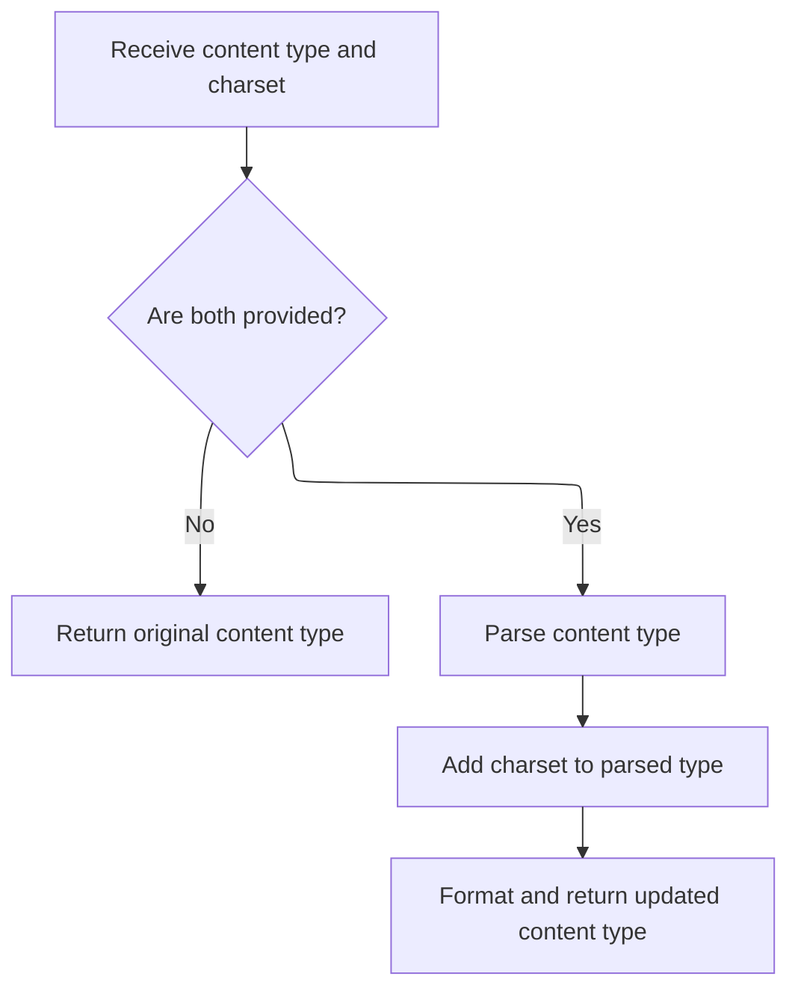

<SwmSnippet path="/lib/utils.js" line="225">

---

<SwmToken path="lib/utils.js" pos="225:2:2" line-data="exports.setCharset = function setCharset(type, charset) {">`setCharset`</SwmToken> parses the <SwmToken path="lib/response.js" pos="137:10:12" line-data="      if (!this.get(&#39;Content-Type&#39;)) {">`Content-Type`</SwmToken> string, updates the charset parameter, and then formats it back to a string. This makes sure the response header includes the correct charset info for the client.

```javascript
exports.setCharset = function setCharset(type, charset) {
  if (!type || !charset) {
    return type;
  }

  // parse type
  var parsed = contentType.parse(type);

  // set charset
  parsed.parameters.charset = charset;

  // format type
  return contentType.format(parsed);
};
```

---

</SwmSnippet>

## Negotiating response format

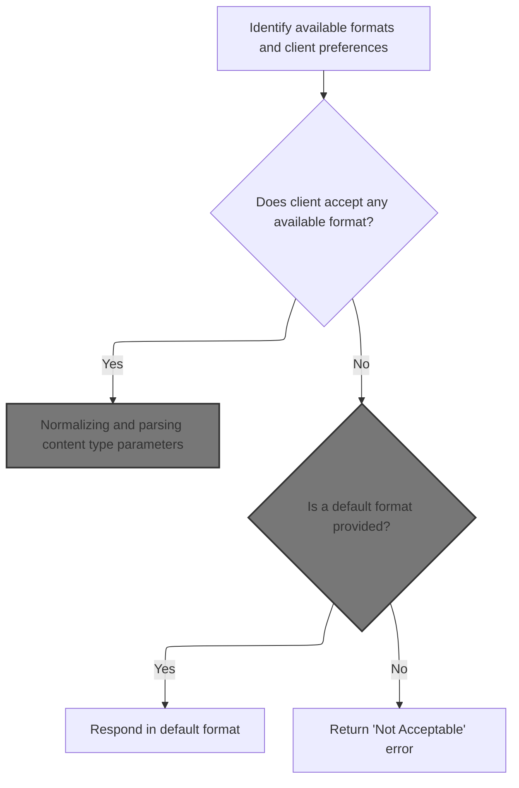

<SwmSnippet path="/lib/response.js" line="576">

---

In <SwmToken path="lib/response.js" pos="576:2:2" line-data="res.format = function(obj){">`format`</SwmToken>, we negotiate the response format, set the <SwmToken path="lib/response.js" pos="590:6:8" line-data="    this.set(&#39;Content-Type&#39;, normalizeType(key).value);">`Content-Type`</SwmToken>, and call the handler for the chosen format.

```javascript
res.format = function(obj){
  var req = this.req;
  var next = req.next;

  var keys = Object.keys(obj)
    .filter(function (v) { return v !== 'default' })

  var key = keys.length > 0
    ? req.accepts(keys)
    : false;

  this.vary("Accept");

  if (key) {
    this.set('Content-Type', normalizeType(key).value);
```

---

</SwmSnippet>

### Normalizing and parsing content type parameters

<SwmSnippet path="/lib/utils.js" line="61">

---

In <SwmToken path="lib/utils.js" pos="61:2:2" line-data="exports.normalizeType = function(type){">`normalizeType`</SwmToken>, if the input type looks like a MIME type (contains '/'), we parse its parameters with <SwmToken path="lib/utils.js" pos="63:3:3" line-data="    ? acceptParams(type)">`acceptParams`</SwmToken>. If not, we use <SwmToken path="lib/utils.js" pos="64:9:11" line-data="    : { value: (mime.lookup(type) || &#39;application/octet-stream&#39;), params: {} }">`mime.lookup`</SwmToken> to resolve it to a MIME type.

```javascript
exports.normalizeType = function(type){
  return ~type.indexOf('/')
    ? acceptParams(type)
```

---

</SwmSnippet>

<SwmSnippet path="/lib/utils.js" line="89">

---

<SwmToken path="lib/utils.js" pos="89:2:2" line-data="function acceptParams (str) {">`acceptParams`</SwmToken> parses a MIME type string with parameters, pulls out the main value, quality factor ('q'), and any other params. It handles the parsing logic so we can use these values for content negotiation.

```javascript
function acceptParams (str) {
  var length = str.length;
  var colonIndex = str.indexOf(';');
  var index = colonIndex === -1 ? length : colonIndex;
  var ret = { value: str.slice(0, index).trim(), quality: 1, params: {} };

  while (index < length) {
    var splitIndex = str.indexOf('=', index);
    if (splitIndex === -1) break;

    var colonIndex = str.indexOf(';', index);
    var endIndex = colonIndex === -1 ? length : colonIndex;

    if (splitIndex > endIndex) {
      index = str.lastIndexOf(';', splitIndex - 1) + 1;
      continue;
    }

    var key = str.slice(index, splitIndex).trim();
    var value = str.slice(splitIndex + 1, endIndex).trim();

    if (key === 'q') {
      ret.quality = parseFloat(value);
    } else {
      ret.params[key] = value;
    }

    index = endIndex + 1;
  }
```

---

</SwmSnippet>

<SwmSnippet path="/lib/utils.js" line="64">

---

After parsing parameters in <SwmToken path="lib/response.js" pos="590:12:12" line-data="    this.set(&#39;Content-Type&#39;, normalizeType(key).value);">`normalizeType`</SwmToken>, if the type isn't a MIME type, we use <SwmToken path="lib/utils.js" pos="64:9:11" line-data="    : { value: (mime.lookup(type) || &#39;application/octet-stream&#39;), params: {} }">`mime.lookup`</SwmToken> to resolve it, or fallback to <SwmToken path="lib/utils.js" pos="64:19:23" line-data="    : { value: (mime.lookup(type) || &#39;application/octet-stream&#39;), params: {} }">`application/octet-stream`</SwmToken>. This guarantees we always have a valid content type for downstream logic.

```javascript
    : { value: (mime.lookup(type) || 'application/octet-stream'), params: {} }
};
```

---

</SwmSnippet>

### Resolving view file paths

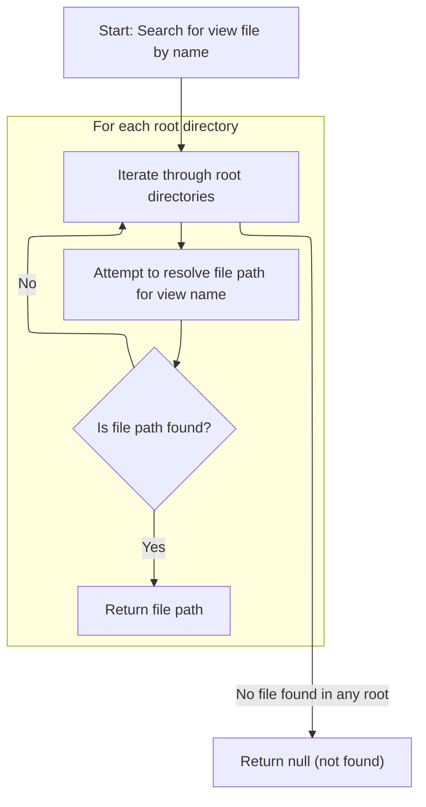

<SwmSnippet path="/lib/view.js" line="104">

---

In <SwmToken path="lib/view.js" pos="104:4:4" line-data="View.prototype.lookup = function lookup(name) {">`lookup`</SwmToken>, we loop through possible root directories, use <SwmToken path="lib/view.js" pos="113:3:3" line-data="    // resolve the path">`resolve`</SwmToken> to build the file path, and then call <SwmToken path="lib/view.js" pos="119:5:7" line-data="    path = this.resolve(dir, file);">`this.resolve`</SwmToken> to check if the file exists. This lets us find the right view file across multiple locations.

```javascript
View.prototype.lookup = function lookup(name) {
  var path;
  var roots = [].concat(this.root);

  debug('lookup "%s"', name);

  for (var i = 0; i < roots.length && !path; i++) {
    var root = roots[i];

    // resolve the path
    var loc = resolve(root, name);
    var dir = dirname(loc);
    var file = basename(loc);

    // resolve the file
    path = this.resolve(dir, file);
  }

  return path;
};
```

---

</SwmSnippet>

<SwmSnippet path="/lib/view.js" line="169">

---

<SwmToken path="lib/view.js" pos="169:4:4" line-data="View.prototype.resolve = function resolve(dir, file) {">`resolve`</SwmToken> checks for the view file in two places: directly as <file>.<ext> and as <file>/index.<ext> inside a subdirectory. This lets us support both flat and nested view structures.

```javascript
View.prototype.resolve = function resolve(dir, file) {
  var ext = this.ext;

  // <path>.<ext>
  var path = join(dir, file);
  var stat = tryStat(path);

  if (stat && stat.isFile()) {
    return path;
  }

  // <path>/index.<ext>
  path = join(dir, basename(file, ext), 'index' + ext);
  stat = tryStat(path);

  if (stat && stat.isFile()) {
    return path;
  }
};
```

---

</SwmSnippet>

### Handling response format fallback and errors

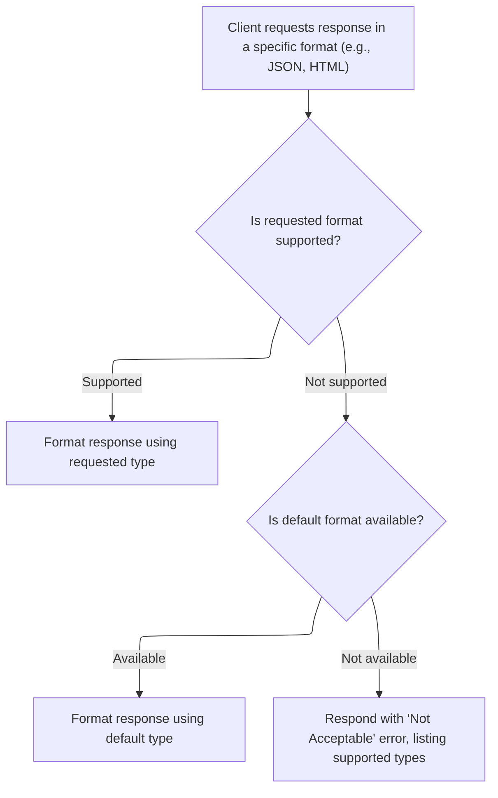

<SwmSnippet path="/lib/response.js" line="591">

---

After normalizing types in <SwmToken path="lib/response.js" pos="576:2:2" line-data="res.format = function(obj){">`format`</SwmToken>, if we find a match, we set <SwmToken path="lib/response.js" pos="137:10:12" line-data="      if (!this.get(&#39;Content-Type&#39;)) {">`Content-Type`</SwmToken> and call the handler. If not, we check for a default handler or send a 406 error. This covers all cases for content negotiation.

```javascript
    obj[key](req, this, next);
  } else if (obj.default) {
    obj.default(req, this, next)
  } else {
    next(createError(406, {
      types: normalizeTypes(keys).map(function (o) { return o.value })
    }))
  }

  return this;
};
```

---

</SwmSnippet>

<SwmSnippet path="/lib/response.js" line="846">

---

In <SwmToken path="lib/response.js" pos="581:19:19" line-data="    .filter(function (v) { return v !== &#39;default&#39; })">`default`</SwmToken>, we just set the body to an empty string. This is a fallback so the client gets a valid response even if there's no content for their requested format.

```javascript
    default: function(){
      body = '';
    }
```

---

</SwmSnippet>

## Setting response headers and status

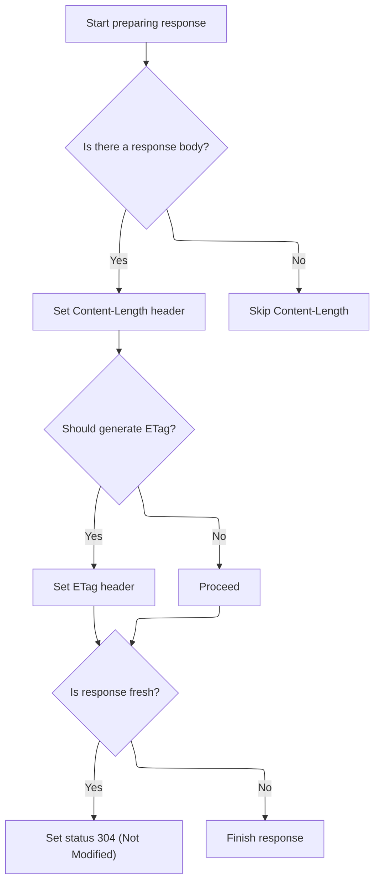

<SwmSnippet path="/lib/response.js" line="167">

---

After updating charset in <SwmToken path="lib/response.js" pos="125:2:2" line-data="res.send = function send(body) {">`send`</SwmToken>, we set <SwmToken path="lib/response.js" pos="171:5:7" line-data="  // populate Content-Length">`Content-Length`</SwmToken>, maybe generate an <SwmToken path="lib/response.js" pos="167:7:7" line-data="  // determine if ETag should be generated">`ETag`</SwmToken>, and if the request is fresh, we call <SwmToken path="lib/response.js" pos="199:11:14" line-data="  if (req.fresh) this.status(304);">`status(304)`</SwmToken>. This sets up the headers and status code for the response.

```javascript
  // determine if ETag should be generated
  var etagFn = app.get('etag fn')
  var generateETag = !this.get('ETag') && typeof etagFn === 'function'

  // populate Content-Length
  var len
  if (chunk !== undefined) {
    if (Buffer.isBuffer(chunk)) {
      // get length of Buffer
      len = chunk.length
    } else if (!generateETag && chunk.length < 1000) {
      // just calculate length when no ETag + small chunk
      len = Buffer.byteLength(chunk, encoding)
    } else {
      // convert chunk to Buffer and calculate
      chunk = Buffer.from(chunk, encoding)
      encoding = undefined;
      len = chunk.length
    }

    this.set('Content-Length', len);
  }

  // populate ETag
  var etag;
  if (generateETag && len !== undefined) {
    if ((etag = etagFn(chunk, encoding))) {
      this.set('ETag', etag);
    }
  }

  // freshness
  if (req.fresh) this.status(304);

```

---

</SwmSnippet>

## Setting the HTTP status code

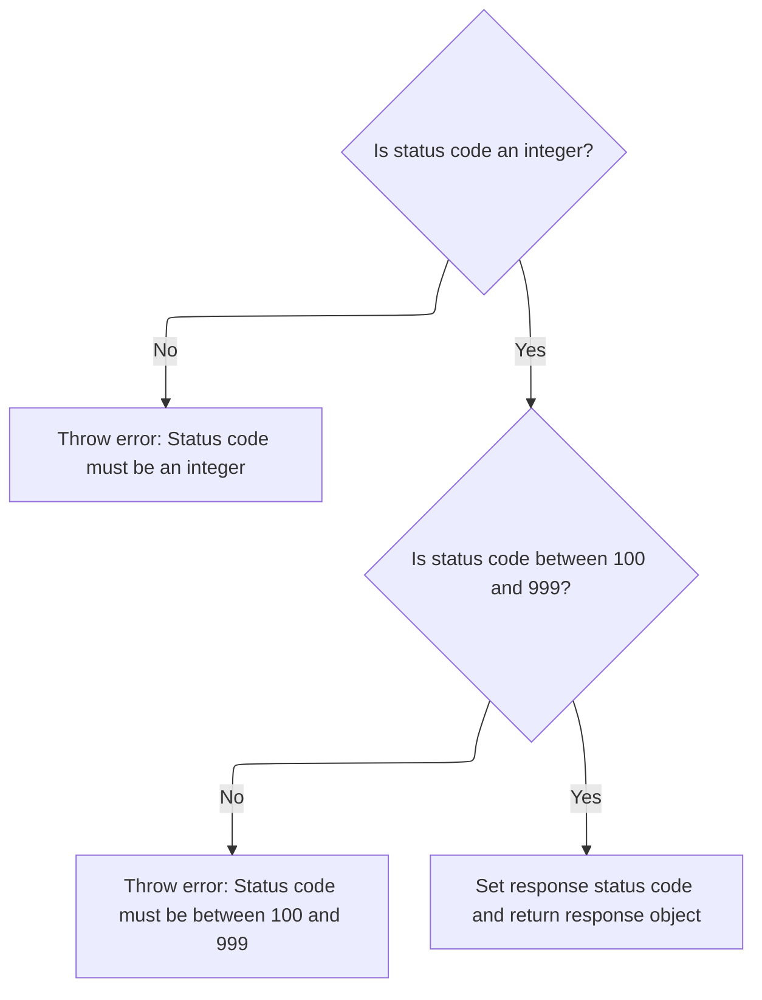

<SwmSnippet path="/lib/response.js" line="64">

---

In <SwmToken path="lib/response.js" pos="64:2:2" line-data="res.status = function status(code) {">`status`</SwmToken>, we check that the code is a valid integer and within the HTTP range. If not, we throw an error. This keeps responses compliant with HTTP standards.

```javascript
res.status = function status(code) {
  // Check if the status code is not an integer
  if (!Number.isInteger(code)) {
    throw new TypeError(`Invalid status code: ${JSON.stringify(code)}. Status code must be an integer.`);
  }
  // Check if the status code is outside of Node's valid range
  if (code < 100 || code > 999) {
    throw new RangeError(`Invalid status code: ${JSON.stringify(code)}. Status code must be greater than 99 and less than 1000.`);
  }

```

---

</SwmSnippet>

<SwmSnippet path="/lib/response.js" line="74">

---

After validating in <SwmToken path="lib/response.js" pos="64:2:2" line-data="res.status = function status(code) {">`status`</SwmToken>, we set the <SwmToken path="lib/response.js" pos="74:3:3" line-data="  this.statusCode = code;">`statusCode`</SwmToken> and return the response object for chaining. This makes sure the client gets the right HTTP status.

```javascript
  this.statusCode = code;
  return this;
};
```

---

</SwmSnippet>

## Finalizing and sending the response

```mermaid
%%{init: {"flowchart": {"defaultRenderer": "elk"}} }%%
flowchart TD
  node1["Prepare HTTP response"]
  click node1 openCode "lib/response.js:201:202"
  node1 --> node2{"Status code 204 (No Content) or 304 (Not Modified)?"}
  click node2 openCode "lib/response.js:202:207"
  node2 -->|"Yes"| node3["Remove content headers, set empty body (no content allowed)"]
  click node3 openCode "lib/response.js:203:207"
  node2 -->|"No"| node4{"Status code 205 (Reset Content)?"}
  click node4 openCode "lib/response.js:210:214"
  node4 -->|"Yes"| node5["Set Content-Length 0, remove Transfer-Encoding, set empty body (reset content)"]
  click node5 openCode "lib/response.js:211:213"
  node4 -->|"No"| node6["Keep headers and body as is"]
  click node6 openCode "lib/response.js:215:215"
  node3 --> node7{"Request method HEAD?"}
  node5 --> node7
  node6 --> node7
  click node7 openCode "lib/response.js:216:219"
  node7 -->|"Yes"| node8["Send headers only (no body for HEAD requests)"]
  click node8 openCode "lib/response.js:218:218"
  node7 -->|"No"| node9["Send headers and body"]
  click node9 openCode "lib/response.js:221:221"
classDef HeadingStyle fill:#777777,stroke:#333,stroke-width:2px;

%% Swimm:
%% %%{init: {"flowchart": {"defaultRenderer": "elk"}} }%%
%% flowchart TD
%%   node1["Prepare HTTP response"]
%%   click node1 openCode "<SwmPath>[lib/response.js](lib/response.js)</SwmPath>:201:202"
%%   node1 --> node2{"Status code 204 (No Content) or 304 (Not Modified)?"}
%%   click node2 openCode "<SwmPath>[lib/response.js](lib/response.js)</SwmPath>:202:207"
%%   node2 -->|"Yes"| node3["Remove content headers, set empty body (no content allowed)"]
%%   click node3 openCode "<SwmPath>[lib/response.js](lib/response.js)</SwmPath>:203:207"
%%   node2 -->|"No"| node4{"Status code 205 (Reset Content)?"}
%%   click node4 openCode "<SwmPath>[lib/response.js](lib/response.js)</SwmPath>:210:214"
%%   node4 -->|"Yes"| node5["Set <SwmToken path="lib/response.js" pos="171:5:7" line-data="  // populate Content-Length">`Content-Length`</SwmToken> 0, remove <SwmToken path="lib/response.js" pos="205:6:8" line-data="    this.removeHeader(&#39;Transfer-Encoding&#39;);">`Transfer-Encoding`</SwmToken>, set empty body (reset content)"]
%%   click node5 openCode "<SwmPath>[lib/response.js](lib/response.js)</SwmPath>:211:213"
%%   node4 -->|"No"| node6["Keep headers and body as is"]
%%   click node6 openCode "<SwmPath>[lib/response.js](lib/response.js)</SwmPath>:215:215"
%%   node3 --> node7{"Request method HEAD?"}
%%   node5 --> node7
%%   node6 --> node7
%%   click node7 openCode "<SwmPath>[lib/response.js](lib/response.js)</SwmPath>:216:219"
%%   node7 -->|"Yes"| node8["Send headers only (no body for HEAD requests)"]
%%   click node8 openCode "<SwmPath>[lib/response.js](lib/response.js)</SwmPath>:218:218"
%%   node7 -->|"No"| node9["Send headers and body"]
%%   click node9 openCode "<SwmPath>[lib/response.js](lib/response.js)</SwmPath>:221:221"
%% classDef HeadingStyle fill:#777777,stroke:#333,stroke-width:2px;
```

<SwmSnippet path="/lib/response.js" line="201">

---

After setting status in <SwmToken path="lib/response.js" pos="125:2:2" line-data="res.send = function send(body) {">`send`</SwmToken>, we strip headers for 204/304, set <SwmToken path="lib/response.js" pos="204:6:8" line-data="    this.removeHeader(&#39;Content-Length&#39;);">`Content-Length`</SwmToken> to 0 for 205, and handle HEAD requests by skipping the body. Otherwise, we send the response body and finish the response.

```javascript
  // strip irrelevant headers
  if (204 === this.statusCode || 304 === this.statusCode) {
    this.removeHeader('Content-Type');
    this.removeHeader('Content-Length');
    this.removeHeader('Transfer-Encoding');
    chunk = '';
  }

  // alter headers for 205
  if (this.statusCode === 205) {
    this.set('Content-Length', '0')
    this.removeHeader('Transfer-Encoding')
    chunk = ''
  }

  if (req.method === 'HEAD') {
    // skip body for HEAD
    this.end();
  } else {
    // respond
    this.end(chunk, encoding);
  }

  return this;
};
```

---

</SwmSnippet>

&nbsp;

*This is an auto-generated document by Swimm 🌊 and has not yet been verified by a human*

<SwmMeta version="3.0.0" repo-id="Z2l0aHViJTNBJTNBSmF2YVNjcmlwdEV4cHJlc3MlM0ElM0FHb3BpbmF0aHJlZGR5NjY=" repo-name="JavaScriptExpress"><sup>Powered by [Swimm](https://app.swimm.io/)</sup></SwmMeta>
