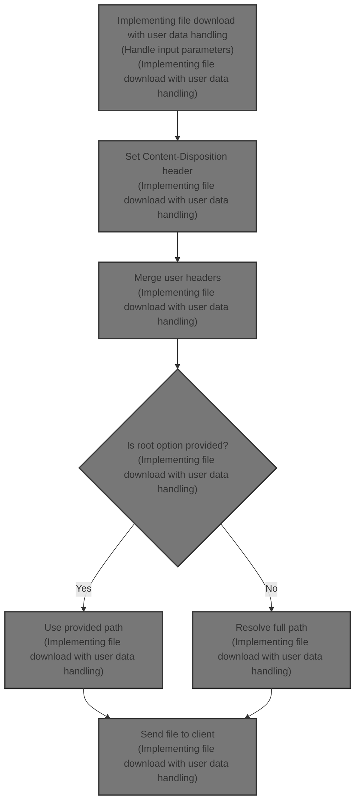

This document explains the flow of implementing file download functionality that handles user data and flexible input parameters. The flow receives a file path, optional filename, options, and a callback as input, and sends the file to the client with appropriate headers for download. It ensures the <SwmToken path="lib/response.js" pos="462:5:7" line-data="  // set Content-Disposition when file is sent">`Content-Disposition`</SwmToken> header is set to suggest a filename, merges user headers, resolves the full file path, and initiates the file transfer.



# Implementing file download with user data handling

```mermaid
%%{init: {"flowchart": {"defaultRenderer": "elk"}} }%%
flowchart TD
    node1["Start download function"] --> node2{"Is filename a function?"}
    click node1 openCode "lib/response.js:440:489"
    node2 -->|"Yes"| node3["Adjust parameters: callback=filename, clear filename and options"]
    click node2 openCode "lib/response.js:446:449"
    node2 -->|"No"| node4{"Is options a function?"}
    click node4 openCode "lib/response.js:450:453"
    node4 -->|"Yes"| node5["Adjust parameters: callback=options, clear options"]
    click node5 openCode "lib/response.js:451:453"
    node4 -->|"No"| node6{"Is filename an options object?"}
    click node6 openCode "lib/response.js:456:460"
    node6 -->|"Yes"| node7["Adjust parameters: options=filename, clear filename"]
    click node7 openCode "lib/response.js:458:460"
    node6 -->|"No"| node8["Set Content-Disposition header with filename or path"]
    click node8 openCode "lib/response.js:463:465"
    node8 --> node9["Merge user headers excluding Content-Disposition"]
    click node9 openCode "lib/response.js:468:475"
    node9 --> node10{"Is root option provided?"}
    click node10 openCode "lib/response.js:483:485"
    node10 -->|"Yes"| node11["Use path as is"]
    click node11 openCode "lib/response.js:484:485"
    node10 -->|"No"| node12["Resolve full path"]
    click node12 openCode "lib/response.js:483:484"
    node11 --> node13["Call sendFile to send the file"]
    click node13 openCode "lib/response.js:488:489"
    node12 --> node13
    node13["End download function"]
classDef HeadingStyle fill:#777777,stroke:#333,stroke-width:2px;

%% Swimm:
%% %%{init: {"flowchart": {"defaultRenderer": "elk"}} }%%
%% flowchart TD
%%     node1["Start download function"] --> node2{"Is filename a function?"}
%%     click node1 openCode "<SwmPath>[lib/response.js](lib/response.js)</SwmPath>:440:489"
%%     node2 -->|"Yes"| node3["Adjust parameters: callback=filename, clear filename and options"]
%%     click node2 openCode "<SwmPath>[lib/response.js](lib/response.js)</SwmPath>:446:449"
%%     node2 -->|"No"| node4{"Is options a function?"}
%%     click node4 openCode "<SwmPath>[lib/response.js](lib/response.js)</SwmPath>:450:453"
%%     node4 -->|"Yes"| node5["Adjust parameters: callback=options, clear options"]
%%     click node5 openCode "<SwmPath>[lib/response.js](lib/response.js)</SwmPath>:451:453"
%%     node4 -->|"No"| node6{"Is filename an options object?"}
%%     click node6 openCode "<SwmPath>[lib/response.js](lib/response.js)</SwmPath>:456:460"
%%     node6 -->|"Yes"| node7["Adjust parameters: options=filename, clear filename"]
%%     click node7 openCode "<SwmPath>[lib/response.js](lib/response.js)</SwmPath>:458:460"
%%     node6 -->|"No"| node8["Set <SwmToken path="lib/response.js" pos="462:5:7" line-data="  // set Content-Disposition when file is sent">`Content-Disposition`</SwmToken> header with filename or path"]
%%     click node8 openCode "<SwmPath>[lib/response.js](lib/response.js)</SwmPath>:463:465"
%%     node8 --> node9["Merge user headers excluding <SwmToken path="lib/response.js" pos="462:5:7" line-data="  // set Content-Disposition when file is sent">`Content-Disposition`</SwmToken>"]
%%     click node9 openCode "<SwmPath>[lib/response.js](lib/response.js)</SwmPath>:468:475"
%%     node9 --> node10{"Is root option provided?"}
%%     click node10 openCode "<SwmPath>[lib/response.js](lib/response.js)</SwmPath>:483:485"
%%     node10 -->|"Yes"| node11["Use path as is"]
%%     click node11 openCode "<SwmPath>[lib/response.js](lib/response.js)</SwmPath>:484:485"
%%     node10 -->|"No"| node12["Resolve full path"]
%%     click node12 openCode "<SwmPath>[lib/response.js](lib/response.js)</SwmPath>:483:484"
%%     node11 --> node13["Call <SwmToken path="lib/response.js" pos="378:2:2" line-data="res.sendFile = function sendFile(path, options, callback) {">`sendFile`</SwmToken> to send the file"]
%%     click node13 openCode "<SwmPath>[lib/response.js](lib/response.js)</SwmPath>:488:489"
%%     node12 --> node13
%%     node13["End download function"]
%% classDef HeadingStyle fill:#777777,stroke:#333,stroke-width:2px;
```



This section implements a file download feature that handles user data and flexible input parameters to send files with appropriate headers and error handling.

| Category        | Rule Name                                                                                                                                         | Description                                                                                                                                                                                                                                                                                             |
| --------------- | ------------------------------------------------------------------------------------------------------------------------------------------------- | ------------------------------------------------------------------------------------------------------------------------------------------------------------------------------------------------------------------------------------------------------------------------------------------------------- |
| Data validation | User existence validation                                                                                                                         | Before creating a pet for a user, the system must verify the user exists; if not, the route handling must be skipped.                                                                                                                                                                                   |
| Business logic  | <SwmToken path="lib/response.js" pos="462:5:7" line-data="  // set Content-Disposition when file is sent">`Content-Disposition`</SwmToken> header | The response must include a <SwmToken path="lib/response.js" pos="462:5:7" line-data="  // set Content-Disposition when file is sent">`Content-Disposition`</SwmToken> header that suggests the filename for the downloaded file, using the provided filename or the file path if no filename is given. |
| Business logic  | Pet creation and association                                                                                                                      | When a pet is created, it must be assigned a unique ID based on its position in the pets array, added to the user's pets list, and a confirmation message must be set.                                                                                                                                  |

<SwmSnippet path="/lib/response.js" line="440">

---

In <SwmToken path="lib/response.js" pos="440:2:2" line-data="res.download = function download (path, filename, options, callback) {">`download`</SwmToken>, we start by handling flexible arguments for path, filename, options, and callback. Then we set the <SwmToken path="lib/response.js" pos="462:5:7" line-data="  // set Content-Disposition when file is sent">`Content-Disposition`</SwmToken> header to suggest a filename for the download. We merge user headers but keep <SwmToken path="lib/response.js" pos="462:5:7" line-data="  // set Content-Disposition when file is sent">`Content-Disposition`</SwmToken> intact. This sets up the response headers before sending the file.

```javascript
res.download = function download (path, filename, options, callback) {
  var done = callback;
  var name = filename;
  var opts = options || null

  // support function as second or third arg
  if (typeof filename === 'function') {
    done = filename;
    name = null;
    opts = null
  } else if (typeof options === 'function') {
    done = options
    opts = null
  }

  // support optional filename, where options may be in it's place
  if (typeof filename === 'object' &&
    (typeof options === 'function' || options === undefined)) {
    name = null
    opts = filename
  }

  // set Content-Disposition when file is sent
  var headers = {
    'Content-Disposition': contentDisposition(name || path)
  };

  // merge user-provided headers
  if (opts && opts.headers) {
    var keys = Object.keys(opts.headers)
    for (var i = 0; i < keys.length; i++) {
      var key = keys[i]
      if (key.toLowerCase() !== 'content-disposition') {
        headers[key] = opts.headers[key]
      }
    }
```

---

</SwmSnippet>

<SwmSnippet path="/lib/response.js" line="478">

---

Here we clone options to safely merge headers and prepare for user-related logic handled next.

```javascript
  // merge user-provided options
  opts = Object.create(opts)
```

---

</SwmSnippet>

<SwmSnippet path="/examples/mvc/controllers/user-pet/index.js" line="12">

---

<SwmToken path="examples/mvc/controllers/user-pet/index.js" pos="12:2:2" line-data="exports.create = function(req, res, next){">`create`</SwmToken> checks if the user exists and skips the route if not. It then creates a pet with a name from the request body, assigns an ID based on its position in the pets array, adds it to the user's pets, sets a message, and redirects. It assumes the request body has the right structure.

```javascript
exports.create = function(req, res, next){
  var id = req.params.user_id;
  var user = db.users[id];
  var body = req.body;
  if (!user) return next('route');
  var pet = { name: body.pet.name };
  pet.id = db.pets.push(pet) - 1;
  user.pets.push(pet);
  res.message('Added pet ' + body.pet.name);
  res.redirect('/user/' + id);
};
```

---

</SwmSnippet>

<SwmSnippet path="/lib/response.js" line="480">

---

After returning from the user-pet controller, <SwmToken path="lib/response.js" pos="440:2:2" line-data="res.download = function download (path, filename, options, callback) {">`download`</SwmToken> finalizes headers and options, resolves the full file path, and calls <SwmToken path="lib/response.js" pos="482:13:13" line-data="  // Resolve the full path for sendFile">`sendFile`</SwmToken> to handle the actual file transfer. This completes the download process by sending the file to the client.

```javascript
  opts.headers = headers

  // Resolve the full path for sendFile
  var fullPath = !opts.root
    ? resolve(path)
    : path

  // send file
  return this.sendFile(fullPath, opts, done)
};
```

---

</SwmSnippet>

<SwmSnippet path="/lib/response.js" line="378">

---

<SwmToken path="lib/response.js" pos="378:2:2" line-data="res.sendFile = function sendFile(path, options, callback) {">`sendFile`</SwmToken> validates the path, encodes it, sets etag based on app settings, then uses send and sendfile to stream the file to the client, handling errors and next middleware calls.

```javascript
res.sendFile = function sendFile(path, options, callback) {
  var done = callback;
  var req = this.req;
  var res = this;
  var next = req.next;
  var opts = options || {};

  if (!path) {
    throw new TypeError('path argument is required to res.sendFile');
  }

  if (typeof path !== 'string') {
    throw new TypeError('path must be a string to res.sendFile')
  }

  // support function as second arg
  if (typeof options === 'function') {
    done = options;
    opts = {};
  }

  if (!opts.root && !pathIsAbsolute(path)) {
    throw new TypeError('path must be absolute or specify root to res.sendFile');
  }

  // create file stream
  var pathname = encodeURI(path);

  // wire application etag option to send
  opts.etag = this.app.enabled('etag');
  var file = send(req, pathname, opts);

  // transfer
  sendfile(res, file, opts, function (err) {
    if (done) return done(err);
    if (err && err.code === 'EISDIR') return next();

    // next() all but write errors
    if (err && err.code !== 'ECONNABORTED' && err.syscall !== 'write') {
      next(err);
    }
  });
};
```

---

</SwmSnippet>

&nbsp;

*This is an auto-generated document by Swimm 🌊 and has not yet been verified by a human*

<SwmMeta version="3.0.0" repo-id="Z2l0aHViJTNBJTNBSmF2YVNjcmlwdEV4cHJlc3MlM0ElM0FHb3BpbmF0aHJlZGR5NjY=" repo-name="JavaScriptExpress"><sup>Powered by [Swimm](https://app.swimm.io/)</sup></SwmMeta>
