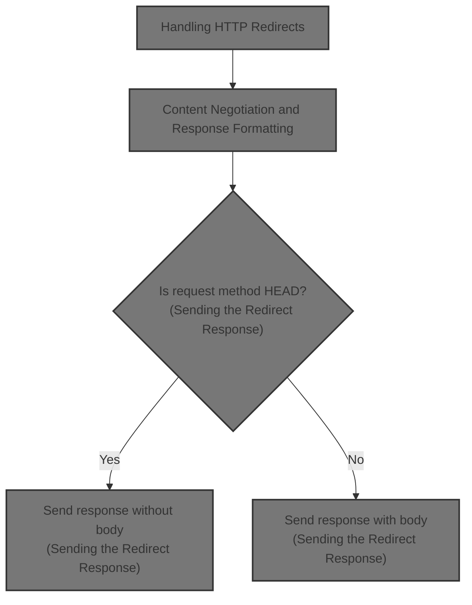
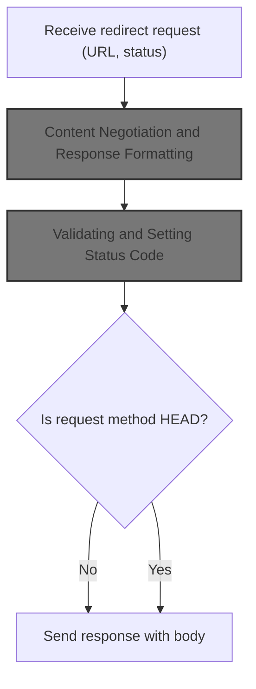
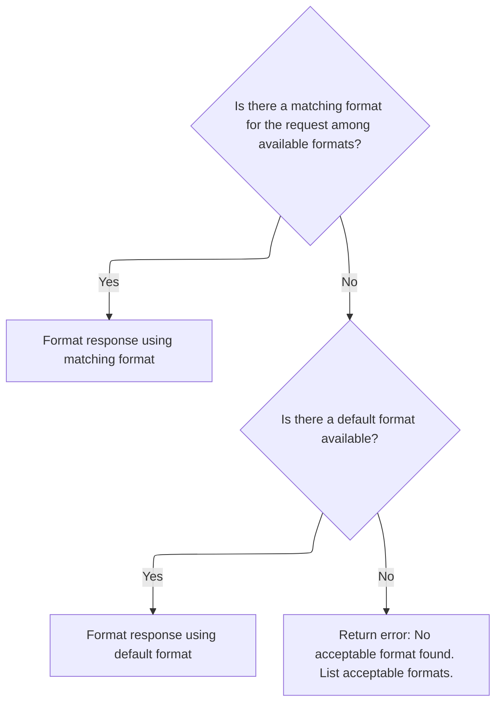
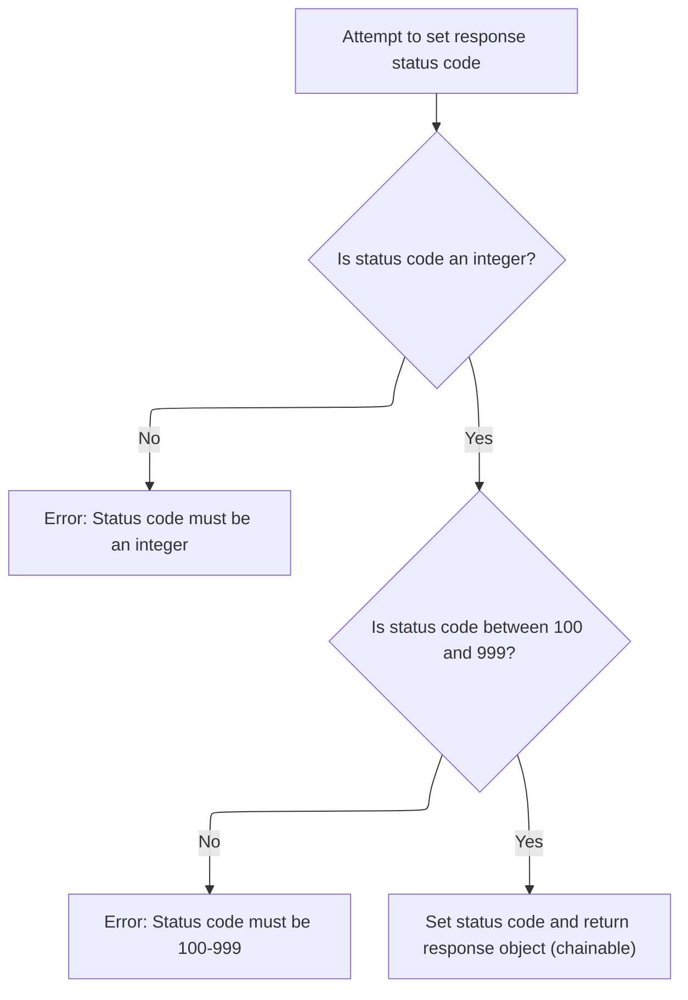

This document describes the flow for handling HTTP redirects. The flow receives a redirect request with a URL and optional status code, negotiates the response format based on client preferences, sets the necessary headers and status code, and sends the redirect response. For HEAD requests, the response is sent without a body.



# Where is this flow used?

This flow is used multiple times in the codebase as represented in the following diagram:

(Note - these are only some of the entry points of this flow)

```mermaid
graph TD;
      3295e1a212829505ec7fc6c1b005a821f32d60b08e6cee3286b372299cb5b010(lib/express.js::createApplication) --> fc53b11ea5da6abc2c89fc15580646db509b4377a7ea7b26fc92569786c709fa(lib/application.js::handle)

3295e1a212829505ec7fc6c1b005a821f32d60b08e6cee3286b372299cb5b010(lib/express.js::createApplication) --> 6ec9d3602e4959e61ed3fd7e8e42d5f07002045c3d1960d2ec6ddc4bdf0e0496(lib/application.js::init)

3295e1a212829505ec7fc6c1b005a821f32d60b08e6cee3286b372299cb5b010(lib/express.js::createApplication) --> e4d3d6cd710719f668961f8ce666afd4565449ff2262650d7813d62198c5852d(index.js::create)

fc53b11ea5da6abc2c89fc15580646db509b4377a7ea7b26fc92569786c709fa(lib/application.js::handle) --> e4d3d6cd710719f668961f8ce666afd4565449ff2262650d7813d62198c5852d(index.js::create)

fc53b11ea5da6abc2c89fc15580646db509b4377a7ea7b26fc92569786c709fa(lib/application.js::handle) --> fc53b11ea5da6abc2c89fc15580646db509b4377a7ea7b26fc92569786c709fa(lib/application.js::handle)

e4d3d6cd710719f668961f8ce666afd4565449ff2262650d7813d62198c5852d(index.js::create) --> 2afcc3a0636914135a2b2d7ba034780b039cf0a9e50b287eb25a710045af4407(lib/response.js::redirect):::mainFlowStyle

6ec9d3602e4959e61ed3fd7e8e42d5f07002045c3d1960d2ec6ddc4bdf0e0496(lib/application.js::init) --> e4d3d6cd710719f668961f8ce666afd4565449ff2262650d7813d62198c5852d(index.js::create)

6ec9d3602e4959e61ed3fd7e8e42d5f07002045c3d1960d2ec6ddc4bdf0e0496(lib/application.js::init) --> 6c12a4d00b8f8ba994eb3dfb7506e3fb87a44544d45a360a35011a7f7f4c5839(lib/application.js::defaultConfiguration)

6c12a4d00b8f8ba994eb3dfb7506e3fb87a44544d45a360a35011a7f7f4c5839(lib/application.js::defaultConfiguration) --> e4d3d6cd710719f668961f8ce666afd4565449ff2262650d7813d62198c5852d(index.js::create)

e40fb758a4a038c3fe85b6e2752bba5d7ea996687a3becb426606e6e43c36468(lib/application.js::mounted_app) --> 9ad090db67bf1aca466b07a69ca4088355594f967b8a5fb48aa049e05bb68c0b(lib/application.js::use)

e40fb758a4a038c3fe85b6e2752bba5d7ea996687a3becb426606e6e43c36468(lib/application.js::mounted_app) --> fc53b11ea5da6abc2c89fc15580646db509b4377a7ea7b26fc92569786c709fa(lib/application.js::handle)

9ad090db67bf1aca466b07a69ca4088355594f967b8a5fb48aa049e05bb68c0b(lib/application.js::use) --> fc53b11ea5da6abc2c89fc15580646db509b4377a7ea7b26fc92569786c709fa(lib/application.js::handle)

9ad090db67bf1aca466b07a69ca4088355594f967b8a5fb48aa049e05bb68c0b(lib/application.js::use) --> 9ad090db67bf1aca466b07a69ca4088355594f967b8a5fb48aa049e05bb68c0b(lib/application.js::use)

a4ea6a802a6702c9a017c94a38ddeb3f5f6646435dd66cb1d38cfe856bfae357(index.js::default) --> 9ad090db67bf1aca466b07a69ca4088355594f967b8a5fb48aa049e05bb68c0b(lib/application.js::use)

5940cb1da7065c64ceb47308c662b707ea87c1cfbcf36d8253e57e9f6c205da9(lib/response.js::download) --> e4d3d6cd710719f668961f8ce666afd4565449ff2262650d7813d62198c5852d(index.js::create)

e1e9823138e4f483cbe498b3d51bb7774085a371b14be32fd86f825e4321f69b(index.js::json) --> 9ad090db67bf1aca466b07a69ca4088355594f967b8a5fb48aa049e05bb68c0b(lib/application.js::use)


classDef mainFlowStyle color:#000000,fill:#7CB9F4
classDef rootsStyle color:#000000,fill:#00FFF4
classDef Style1 color:#000000,fill:#00FFAA
classDef Style2 color:#000000,fill:#FFFF00
classDef Style3 color:#000000,fill:#AA7CB9

%% Swimm:
%% graph TD;
%%       3295e1a212829505ec7fc6c1b005a821f32d60b08e6cee3286b372299cb5b010(<SwmPath>[lib/express.js](lib/express.js)</SwmPath>::createApplication) --> fc53b11ea5da6abc2c89fc15580646db509b4377a7ea7b26fc92569786c709fa(<SwmPath>[lib/application.js](lib/application.js)</SwmPath>::handle)
%% 
%% 3295e1a212829505ec7fc6c1b005a821f32d60b08e6cee3286b372299cb5b010(<SwmPath>[lib/express.js](lib/express.js)</SwmPath>::createApplication) --> 6ec9d3602e4959e61ed3fd7e8e42d5f07002045c3d1960d2ec6ddc4bdf0e0496(<SwmPath>[lib/application.js](lib/application.js)</SwmPath>::init)
%% 
%% 3295e1a212829505ec7fc6c1b005a821f32d60b08e6cee3286b372299cb5b010(<SwmPath>[lib/express.js](lib/express.js)</SwmPath>::createApplication) --> e4d3d6cd710719f668961f8ce666afd4565449ff2262650d7813d62198c5852d(<SwmPath>[index.js](index.js)</SwmPath>::create)
%% 
%% fc53b11ea5da6abc2c89fc15580646db509b4377a7ea7b26fc92569786c709fa(<SwmPath>[lib/application.js](lib/application.js)</SwmPath>::handle) --> e4d3d6cd710719f668961f8ce666afd4565449ff2262650d7813d62198c5852d(<SwmPath>[index.js](index.js)</SwmPath>::create)
%% 
%% fc53b11ea5da6abc2c89fc15580646db509b4377a7ea7b26fc92569786c709fa(<SwmPath>[lib/application.js](lib/application.js)</SwmPath>::handle) --> fc53b11ea5da6abc2c89fc15580646db509b4377a7ea7b26fc92569786c709fa(<SwmPath>[lib/application.js](lib/application.js)</SwmPath>::handle)
%% 
%% e4d3d6cd710719f668961f8ce666afd4565449ff2262650d7813d62198c5852d(<SwmPath>[index.js](index.js)</SwmPath>::create) --> 2afcc3a0636914135a2b2d7ba034780b039cf0a9e50b287eb25a710045af4407(<SwmPath>[lib/response.js](lib/response.js)</SwmPath>::redirect):::mainFlowStyle
%% 
%% 6ec9d3602e4959e61ed3fd7e8e42d5f07002045c3d1960d2ec6ddc4bdf0e0496(<SwmPath>[lib/application.js](lib/application.js)</SwmPath>::init) --> e4d3d6cd710719f668961f8ce666afd4565449ff2262650d7813d62198c5852d(<SwmPath>[index.js](index.js)</SwmPath>::create)
%% 
%% 6ec9d3602e4959e61ed3fd7e8e42d5f07002045c3d1960d2ec6ddc4bdf0e0496(<SwmPath>[lib/application.js](lib/application.js)</SwmPath>::init) --> 6c12a4d00b8f8ba994eb3dfb7506e3fb87a44544d45a360a35011a7f7f4c5839(<SwmPath>[lib/application.js](lib/application.js)</SwmPath>::defaultConfiguration)
%% 
%% 6c12a4d00b8f8ba994eb3dfb7506e3fb87a44544d45a360a35011a7f7f4c5839(<SwmPath>[lib/application.js](lib/application.js)</SwmPath>::defaultConfiguration) --> e4d3d6cd710719f668961f8ce666afd4565449ff2262650d7813d62198c5852d(<SwmPath>[index.js](index.js)</SwmPath>::create)
%% 
%% e40fb758a4a038c3fe85b6e2752bba5d7ea996687a3becb426606e6e43c36468(<SwmPath>[lib/application.js](lib/application.js)</SwmPath>::mounted_app) --> 9ad090db67bf1aca466b07a69ca4088355594f967b8a5fb48aa049e05bb68c0b(<SwmPath>[lib/application.js](lib/application.js)</SwmPath>::use)
%% 
%% e40fb758a4a038c3fe85b6e2752bba5d7ea996687a3becb426606e6e43c36468(<SwmPath>[lib/application.js](lib/application.js)</SwmPath>::mounted_app) --> fc53b11ea5da6abc2c89fc15580646db509b4377a7ea7b26fc92569786c709fa(<SwmPath>[lib/application.js](lib/application.js)</SwmPath>::handle)
%% 
%% 9ad090db67bf1aca466b07a69ca4088355594f967b8a5fb48aa049e05bb68c0b(<SwmPath>[lib/application.js](lib/application.js)</SwmPath>::use) --> fc53b11ea5da6abc2c89fc15580646db509b4377a7ea7b26fc92569786c709fa(<SwmPath>[lib/application.js](lib/application.js)</SwmPath>::handle)
%% 
%% 9ad090db67bf1aca466b07a69ca4088355594f967b8a5fb48aa049e05bb68c0b(<SwmPath>[lib/application.js](lib/application.js)</SwmPath>::use) --> 9ad090db67bf1aca466b07a69ca4088355594f967b8a5fb48aa049e05bb68c0b(<SwmPath>[lib/application.js](lib/application.js)</SwmPath>::use)
%% 
%% a4ea6a802a6702c9a017c94a38ddeb3f5f6646435dd66cb1d38cfe856bfae357(<SwmPath>[index.js](index.js)</SwmPath>::default) --> 9ad090db67bf1aca466b07a69ca4088355594f967b8a5fb48aa049e05bb68c0b(<SwmPath>[lib/application.js](lib/application.js)</SwmPath>::use)
%% 
%% 5940cb1da7065c64ceb47308c662b707ea87c1cfbcf36d8253e57e9f6c205da9(<SwmPath>[lib/response.js](lib/response.js)</SwmPath>::download) --> e4d3d6cd710719f668961f8ce666afd4565449ff2262650d7813d62198c5852d(<SwmPath>[index.js](index.js)</SwmPath>::create)
%% 
%% e1e9823138e4f483cbe498b3d51bb7774085a371b14be32fd86f825e4321f69b(<SwmPath>[index.js](index.js)</SwmPath>::json) --> 9ad090db67bf1aca466b07a69ca4088355594f967b8a5fb48aa049e05bb68c0b(<SwmPath>[lib/application.js](lib/application.js)</SwmPath>::use)
%% 
%% 
%% classDef mainFlowStyle color:#000000,fill:#7CB9F4
%% classDef rootsStyle color:#000000,fill:#00FFF4
%% classDef Style1 color:#000000,fill:#00FFAA
%% classDef Style2 color:#000000,fill:#FFFF00
%% classDef Style3 color:#000000,fill:#AA7CB9
```



# Handling HTTP Redirects



<SwmSnippet path="/lib/response.js" line="819">

---

In <SwmToken path="lib/response.js" pos="819:2:2" line-data="res.redirect = function redirect(url) {">`redirect`</SwmToken>, we start by figuring out if we're dealing with a status code and URL or just a URL, then normalize the Location header using a repo-specific method. Next, we call <SwmToken path="lib/response.js" pos="846:3:3" line-data="  this.format({">`format`</SwmToken> to handle content negotiation, so the response body matches the client's expected content type (text, html, or default).

```javascript
res.redirect = function redirect(url) {
  var address = url;
  var body;
  var status = 302;

  // allow status / url
  if (arguments.length === 2) {
    status = arguments[0]
    address = arguments[1]
  }

  if (!address) {
    deprecate('Provide a url argument');
  }

  if (typeof address !== 'string') {
    deprecate('Url must be a string');
  }

  if (typeof status !== 'number') {
    deprecate('Status must be a number');
  }

  // Set location header
  address = this.location(address).get('Location');

  // Support text/{plain,html} by default
  this.format({
    text: function(){
      body = statuses.message[status] + '. Redirecting to ' + address
    },

    html: function(){
      var u = escapeHtml(address);
      body = '<p>' + statuses.message[status] + '. Redirecting to ' + u + '</p>'
    },

    default: function(){
      body = '';
    }
  });

```

---

</SwmSnippet>

## Content Negotiation and Response Formatting

<SwmSnippet path="/lib/response.js" line="576">

---

In <SwmToken path="lib/response.js" pos="576:2:2" line-data="res.format = function(obj){">`format`</SwmToken>, we pull out the available content types from the handlers, match them against what the client accepts, and set up the response accordingly. We need to call <SwmToken path="lib/response.js" pos="590:12:12" line-data="    this.set(&#39;Content-Type&#39;, normalizeType(key).value);">`normalizeType`</SwmToken> next to make sure the <SwmToken path="lib/response.js" pos="590:6:8" line-data="    this.set(&#39;Content-Type&#39;, normalizeType(key).value);">`Content-Type`</SwmToken> header is set correctly for the matched type.

```javascript
res.format = function(obj){
  var req = this.req;
  var next = req.next;

  var keys = Object.keys(obj)
    .filter(function (v) { return v !== 'default' })

  var key = keys.length > 0
    ? req.accepts(keys)
    : false;

  this.vary("Accept");

  if (key) {
    this.set('Content-Type', normalizeType(key).value);
```

---

</SwmSnippet>

### MIME Type Normalization and Parameter Parsing

```mermaid
%%{init: {"flowchart": {"defaultRenderer": "elk"}} }%%
flowchart TD
  node1["Receive type string"] --> node2{"Does type contain '/'"}
  click node1 openCode "lib/utils.js:61:62"
  node2 -->|"Yes"| node3["Extract value and parameters, set quality to 1"]
  click node2 openCode "lib/utils.js:62:63"
  node2 -->|"No"| node4["Lookup MIME type or use application/octet-stream"]
  click node3 openCode "lib/utils.js:89:117"
  click node4 openCode "lib/utils.js:64:65"
  node3 --> node5["Return normalized type object (value, params, quality)"]
  node4 --> node5
  click node5 openCode "lib/utils.js:62:65"

classDef HeadingStyle fill:#777777,stroke:#333,stroke-width:2px;

%% Swimm:
%% %%{init: {"flowchart": {"defaultRenderer": "elk"}} }%%
%% flowchart TD
%%   node1["Receive type string"] --> node2{"Does type contain '/'"}
%%   click node1 openCode "<SwmPath>[lib/utils.js](lib/utils.js)</SwmPath>:61:62"
%%   node2 -->|"Yes"| node3["Extract value and parameters, set quality to 1"]
%%   click node2 openCode "<SwmPath>[lib/utils.js](lib/utils.js)</SwmPath>:62:63"
%%   node2 -->|"No"| node4["Lookup MIME type or use <SwmToken path="lib/utils.js" pos="64:19:23" line-data="    : { value: (mime.lookup(type) || &#39;application/octet-stream&#39;), params: {} }">`application/octet-stream`</SwmToken>"]
%%   click node3 openCode "<SwmPath>[lib/utils.js](lib/utils.js)</SwmPath>:89:117"
%%   click node4 openCode "<SwmPath>[lib/utils.js](lib/utils.js)</SwmPath>:64:65"
%%   node3 --> node5["Return normalized type object (value, params, quality)"]
%%   node4 --> node5
%%   click node5 openCode "<SwmPath>[lib/utils.js](lib/utils.js)</SwmPath>:62:65"
%% 
%% classDef HeadingStyle fill:#777777,stroke:#333,stroke-width:2px;
```



<SwmSnippet path="/lib/utils.js" line="61">

---

In <SwmToken path="lib/utils.js" pos="61:2:2" line-data="exports.normalizeType = function(type){">`normalizeType`</SwmToken>, we check if the input looks like a MIME type and, if so, pass it to <SwmToken path="lib/utils.js" pos="63:3:3" line-data="    ? acceptParams(type)">`acceptParams`</SwmToken> for parsing. This sets up the structure for handling content negotiation parameters.

```javascript
exports.normalizeType = function(type){
  return ~type.indexOf('/')
    ? acceptParams(type)
```

---

</SwmSnippet>

<SwmSnippet path="/lib/utils.js" line="89">

---

<SwmToken path="lib/utils.js" pos="89:2:2" line-data="function acceptParams (str) {">`acceptParams`</SwmToken> breaks down a MIME type string into its main value, quality factor ('q'), and any extra parameters. It does this by scanning for semicolons and equal signs, and gives special treatment to 'q' for HTTP content negotiation.

```javascript
function acceptParams (str) {
  var length = str.length;
  var colonIndex = str.indexOf(';');
  var index = colonIndex === -1 ? length : colonIndex;
  var ret = { value: str.slice(0, index).trim(), quality: 1, params: {} };

  while (index < length) {
    var splitIndex = str.indexOf('=', index);
    if (splitIndex === -1) break;

    var colonIndex = str.indexOf(';', index);
    var endIndex = colonIndex === -1 ? length : colonIndex;

    if (splitIndex > endIndex) {
      index = str.lastIndexOf(';', splitIndex - 1) + 1;
      continue;
    }

    var key = str.slice(index, splitIndex).trim();
    var value = str.slice(splitIndex + 1, endIndex).trim();

    if (key === 'q') {
      ret.quality = parseFloat(value);
    } else {
      ret.params[key] = value;
    }

    index = endIndex + 1;
  }
```

---

</SwmSnippet>

<SwmSnippet path="/lib/utils.js" line="64">

---

We just got back from <SwmToken path="lib/response.js" pos="590:12:12" line-data="    this.set(&#39;Content-Type&#39;, normalizeType(key).value);">`normalizeType`</SwmToken> in <SwmPath>[lib/utils.js](lib/utils.js)</SwmPath>. If the input isn't a MIME type, we look it up with <SwmToken path="lib/utils.js" pos="64:9:11" line-data="    : { value: (mime.lookup(type) || &#39;application/octet-stream&#39;), params: {} }">`mime.lookup`</SwmToken> and set a default value. Next, we need to resolve the actual file path for the view, so we call into <SwmPath>[lib/view.js](lib/view.js)</SwmPath>.

```javascript
    : { value: (mime.lookup(type) || 'application/octet-stream'), params: {} }
};
```

---

</SwmSnippet>

<SwmSnippet path="/lib/view.js" line="104">

---

<SwmToken path="lib/view.js" pos="104:4:4" line-data="View.prototype.lookup = function lookup(name) {">`lookup`</SwmToken> in <SwmPath>[lib/view.js](lib/view.js)</SwmPath> checks all possible root directories for the requested view, resolving the path using a helper. It stops as soon as it finds a valid file, making template lookup flexible across multiple roots.

```javascript
View.prototype.lookup = function lookup(name) {
  var path;
  var roots = [].concat(this.root);

  debug('lookup "%s"', name);

  for (var i = 0; i < roots.length && !path; i++) {
    var root = roots[i];

    // resolve the path
    var loc = resolve(root, name);
    var dir = dirname(loc);
    var file = basename(loc);

    // resolve the file
    path = this.resolve(dir, file);
  }
```

---

</SwmSnippet>

### Finalizing Content Negotiation



<SwmSnippet path="/lib/response.js" line="591">

---

We just got back from <SwmToken path="lib/response.js" pos="590:12:12" line-data="    this.set(&#39;Content-Type&#39;, normalizeType(key).value);">`normalizeType`</SwmToken> in <SwmPath>[lib/utils.js](lib/utils.js)</SwmPath>. Now, in <SwmToken path="lib/response.js" pos="576:2:2" line-data="res.format = function(obj){">`format`</SwmToken>, we run the handler for the matched content type, or fall back to 'default' if there's no match. If neither is available, we send a 406 error. Next, we need to handle the default case for the response body.

```javascript
    obj[key](req, this, next);
  } else if (obj.default) {
    obj.default(req, this, next)
  } else {
    next(createError(406, {
      types: normalizeTypes(keys).map(function (o) { return o.value })
    }))
  }

  return this;
};
```

---

</SwmSnippet>

<SwmSnippet path="/lib/response.js" line="846">

---

<SwmToken path="lib/response.js" pos="581:19:19" line-data="    .filter(function (v) { return v !== &#39;default&#39; })">`default`</SwmToken> just sets the response body to an empty string if no content type matches. This keeps the response valid even when the client doesn't specify a supported type.

```javascript
    default: function(){
      body = '';
    }
```

---

</SwmSnippet>

## Setting the Response Status

<SwmSnippet path="/lib/response.js" line="861">

---

We just finished content negotiation in <SwmToken path="lib/response.js" pos="819:2:2" line-data="res.redirect = function redirect(url) {">`redirect`</SwmToken>. Now we set the HTTP status code for the response, which is needed before sending headers and body.

```javascript
  // Respond
  this.status(status);
```

---

</SwmSnippet>

## Validating and Setting Status Code



<SwmSnippet path="/lib/response.js" line="64">

---

In <SwmToken path="lib/response.js" pos="64:2:2" line-data="res.status = function status(code) {">`status`</SwmToken>, we check that the code is a valid integer and within the HTTP range. If not, we throw with a JSON-stringified error message for clarity.

```javascript
res.status = function status(code) {
  // Check if the status code is not an integer
  if (!Number.isInteger(code)) {
    throw new TypeError(`Invalid status code: ${JSON.stringify(code)}. Status code must be an integer.`);
  }
  // Check if the status code is outside of Node's valid range
  if (code < 100 || code > 999) {
    throw new RangeError(`Invalid status code: ${JSON.stringify(code)}. Status code must be greater than 99 and less than 1000.`);
  }

```

---

</SwmSnippet>

<SwmSnippet path="/lib/response.js" line="1029">

---

<SwmToken path="lib/response.js" pos="1029:2:2" line-data="function stringify (value, replacer, spaces, escape) {">`stringify`</SwmToken> turns a value into JSON and, if needed, escapes <, >, and & to keep things safe when the output is used in HTML.

```javascript
function stringify (value, replacer, spaces, escape) {
  // v8 checks arguments.length for optimizing simple call
  // https://bugs.chromium.org/p/v8/issues/detail?id=4730
  var json = replacer || spaces
    ? JSON.stringify(value, replacer, spaces)
    : JSON.stringify(value);

  if (escape && typeof json === 'string') {
    json = json.replace(/[<>&]/g, function (c) {
      switch (c.charCodeAt(0)) {
        case 0x3c:
          return '\\u003c'
        case 0x3e:
          return '\\u003e'
        case 0x26:
          return '\\u0026'
        /* istanbul ignore next: unreachable default */
        default:
          return c
      }
    })
  }

  return json
}
```

---

</SwmSnippet>

<SwmSnippet path="/lib/response.js" line="74">

---

We just got back from <SwmToken path="lib/response.js" pos="67:19:19" line-data="    throw new TypeError(`Invalid status code: ${JSON.stringify(code)}. Status code must be an integer.`);">`stringify`</SwmToken>, so now in <SwmToken path="lib/response.js" pos="64:2:2" line-data="res.status = function status(code) {">`status`</SwmToken> we set the validated status code on the response and return the response object for chaining.

```javascript
  this.statusCode = code;
  return this;
};
```

---

</SwmSnippet>

## Sending the Redirect Response

<SwmSnippet path="/lib/response.js" line="863">

---

We just finished setting the status in <SwmToken path="lib/response.js" pos="819:2:2" line-data="res.redirect = function redirect(url) {">`redirect`</SwmToken>. Now we set the <SwmToken path="lib/response.js" pos="863:6:8" line-data="  this.set(&#39;Content-Length&#39;, Buffer.byteLength(body));">`Content-Length`</SwmToken> header and end the response, sending the body unless it's a HEAD request, in which case we skip the body.

```javascript
  this.set('Content-Length', Buffer.byteLength(body));

  if (this.req.method === 'HEAD') {
    this.end();
  } else {
    this.end(body);
  }
};
```

---

</SwmSnippet>

&nbsp;

*This is an auto-generated document by Swimm 🌊 and has not yet been verified by a human*

<SwmMeta version="3.0.0" repo-id="Z2l0aHViJTNBJTNBSmF2YVNjcmlwdEV4cHJlc3MlM0ElM0FHb3BpbmF0aHJlZGR5NjY=" repo-name="JavaScriptExpress"><sup>Powered by [Swimm](https://app.swimm.io/)</sup></SwmMeta>
