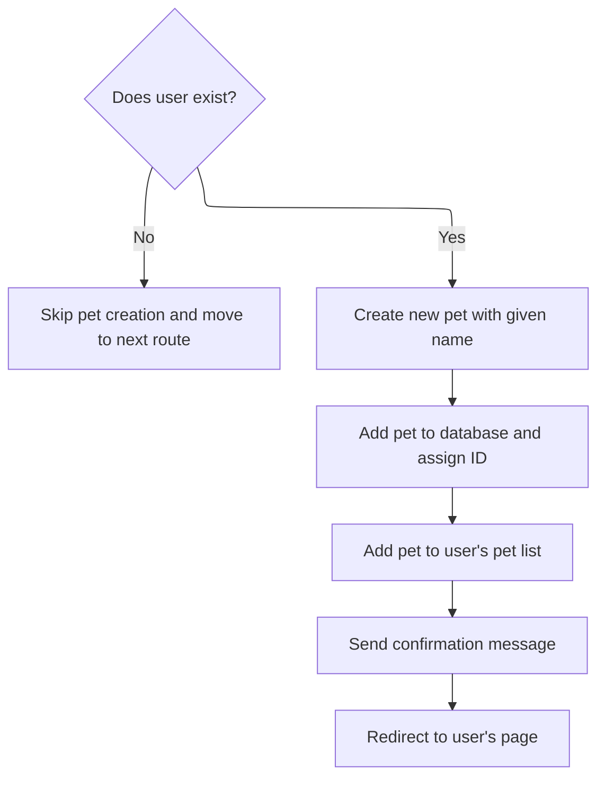

This document describes the flow of handling an HTTP request to create a pet for a user. It prepares the request and response, verifies user existence, creates a pet, sends confirmation, redirects the client, and passes control to the router to complete the response.

# Where is this flow used?

This flow is used multiple times in the codebase as represented in the following diagram:

(Note - these are only some of the entry points of this flow)

```mermaid
graph TD;
      3295e1a212829505ec7fc6c1b005a821f32d60b08e6cee3286b372299cb5b010(lib/express.js::createApplication) --> fc53b11ea5da6abc2c89fc15580646db509b4377a7ea7b26fc92569786c709fa(lib/application.js::handle):::mainFlowStyle

e40fb758a4a038c3fe85b6e2752bba5d7ea996687a3becb426606e6e43c36468(lib/application.js::mounted_app) --> 9ad090db67bf1aca466b07a69ca4088355594f967b8a5fb48aa049e05bb68c0b(lib/application.js::use)

e40fb758a4a038c3fe85b6e2752bba5d7ea996687a3becb426606e6e43c36468(lib/application.js::mounted_app) --> fc53b11ea5da6abc2c89fc15580646db509b4377a7ea7b26fc92569786c709fa(lib/application.js::handle):::mainFlowStyle

9ad090db67bf1aca466b07a69ca4088355594f967b8a5fb48aa049e05bb68c0b(lib/application.js::use) --> fc53b11ea5da6abc2c89fc15580646db509b4377a7ea7b26fc92569786c709fa(lib/application.js::handle):::mainFlowStyle

9ad090db67bf1aca466b07a69ca4088355594f967b8a5fb48aa049e05bb68c0b(lib/application.js::use) --> 9ad090db67bf1aca466b07a69ca4088355594f967b8a5fb48aa049e05bb68c0b(lib/application.js::use)

a4ea6a802a6702c9a017c94a38ddeb3f5f6646435dd66cb1d38cfe856bfae357(index.js::default) --> 9ad090db67bf1aca466b07a69ca4088355594f967b8a5fb48aa049e05bb68c0b(lib/application.js::use)

e1e9823138e4f483cbe498b3d51bb7774085a371b14be32fd86f825e4321f69b(index.js::json) --> 9ad090db67bf1aca466b07a69ca4088355594f967b8a5fb48aa049e05bb68c0b(lib/application.js::use)

3d7282351d10a1a3b2d672d15fcff632f585623177dd2b70a0e24e3c186a6df2(index.js::html) --> 9ad090db67bf1aca466b07a69ca4088355594f967b8a5fb48aa049e05bb68c0b(lib/application.js::use)


classDef mainFlowStyle color:#000000,fill:#7CB9F4
classDef rootsStyle color:#000000,fill:#00FFF4
classDef Style1 color:#000000,fill:#00FFAA
classDef Style2 color:#000000,fill:#FFFF00
classDef Style3 color:#000000,fill:#AA7CB9

%% Swimm:
%% graph TD;
%%       3295e1a212829505ec7fc6c1b005a821f32d60b08e6cee3286b372299cb5b010(<SwmPath>[lib/express.js](lib/express.js)</SwmPath>::createApplication) --> fc53b11ea5da6abc2c89fc15580646db509b4377a7ea7b26fc92569786c709fa(<SwmPath>[lib/application.js](lib/application.js)</SwmPath>::handle):::mainFlowStyle
%% 
%% e40fb758a4a038c3fe85b6e2752bba5d7ea996687a3becb426606e6e43c36468(<SwmPath>[lib/application.js](lib/application.js)</SwmPath>::<SwmToken path="lib/application.js" pos="230:10:10" line-data="    router.use(path, function mounted_app(req, res, next) {">`mounted_app`</SwmToken>) --> 9ad090db67bf1aca466b07a69ca4088355594f967b8a5fb48aa049e05bb68c0b(<SwmPath>[lib/application.js](lib/application.js)</SwmPath>::use)
%% 
%% e40fb758a4a038c3fe85b6e2752bba5d7ea996687a3becb426606e6e43c36468(<SwmPath>[lib/application.js](lib/application.js)</SwmPath>::<SwmToken path="lib/application.js" pos="230:10:10" line-data="    router.use(path, function mounted_app(req, res, next) {">`mounted_app`</SwmToken>) --> fc53b11ea5da6abc2c89fc15580646db509b4377a7ea7b26fc92569786c709fa(<SwmPath>[lib/application.js](lib/application.js)</SwmPath>::handle):::mainFlowStyle
%% 
%% 9ad090db67bf1aca466b07a69ca4088355594f967b8a5fb48aa049e05bb68c0b(<SwmPath>[lib/application.js](lib/application.js)</SwmPath>::use) --> fc53b11ea5da6abc2c89fc15580646db509b4377a7ea7b26fc92569786c709fa(<SwmPath>[lib/application.js](lib/application.js)</SwmPath>::handle):::mainFlowStyle
%% 
%% 9ad090db67bf1aca466b07a69ca4088355594f967b8a5fb48aa049e05bb68c0b(<SwmPath>[lib/application.js](lib/application.js)</SwmPath>::use) --> 9ad090db67bf1aca466b07a69ca4088355594f967b8a5fb48aa049e05bb68c0b(<SwmPath>[lib/application.js](lib/application.js)</SwmPath>::use)
%% 
%% a4ea6a802a6702c9a017c94a38ddeb3f5f6646435dd66cb1d38cfe856bfae357(<SwmPath>[index.js](index.js)</SwmPath>::default) --> 9ad090db67bf1aca466b07a69ca4088355594f967b8a5fb48aa049e05bb68c0b(<SwmPath>[lib/application.js](lib/application.js)</SwmPath>::use)
%% 
%% e1e9823138e4f483cbe498b3d51bb7774085a371b14be32fd86f825e4321f69b(<SwmPath>[index.js](index.js)</SwmPath>::json) --> 9ad090db67bf1aca466b07a69ca4088355594f967b8a5fb48aa049e05bb68c0b(<SwmPath>[lib/application.js](lib/application.js)</SwmPath>::use)
%% 
%% 3d7282351d10a1a3b2d672d15fcff632f585623177dd2b70a0e24e3c186a6df2(<SwmPath>[index.js](index.js)</SwmPath>::html) --> 9ad090db67bf1aca466b07a69ca4088355594f967b8a5fb48aa049e05bb68c0b(<SwmPath>[lib/application.js](lib/application.js)</SwmPath>::use)
%% 
%% 
%% classDef mainFlowStyle color:#000000,fill:#7CB9F4
%% classDef rootsStyle color:#000000,fill:#00FFF4
%% classDef Style1 color:#000000,fill:#00FFAA
%% classDef Style2 color:#000000,fill:#FFFF00
%% classDef Style3 color:#000000,fill:#AA7CB9
```



# Starting the request handling

This section handles the initial setup for processing an HTTP request and response in the application.

<SwmSnippet path="/lib/application.js" line="152">

---

We link req and res for easy access, adjust their prototypes, and prepare <SwmToken path="lib/application.js" pos="173:5:7" line-data="  if (!res.locals) {">`res.locals`</SwmToken> for later use.

```javascript
app.handle = function handle(req, res, callback) {
  // final handler
  var done = callback || finalhandler(req, res, {
    env: this.get('env'),
    onerror: logerror.bind(this)
  });

  // set powered by header
  if (this.enabled('x-powered-by')) {
    res.setHeader('X-Powered-By', 'Express');
  }

  // set circular references
  req.res = res;
  res.req = req;

  // alter the prototypes
  Object.setPrototypeOf(req, this.request)
  Object.setPrototypeOf(res, this.response)

  // setup locals
  if (!res.locals) {
    res.locals = Object.create(null);
  }

```

---

</SwmSnippet>

## Creating a pet and redirecting



This section handles creating a new pet for an existing user and then redirecting the client to the user's page with a confirmation message.

| Category        | Rule Name                   | Description                                                                                                                                |
| --------------- | --------------------------- | ------------------------------------------------------------------------------------------------------------------------------------------ |
| Data validation | User existence check        | If the user does not exist, skip pet creation and move to the next route without any changes.                                              |
| Business logic  | Pet creation and assignment | Create a new pet only if the user exists, assigning the pet a unique ID and adding it to both the global pet list and the user's pet list. |
| Business logic  | Confirmation message        | Send a confirmation message to the client indicating the pet has been added successfully.                                                  |
| Business logic  | Post-creation redirect      | Redirect the client to the user's page after pet creation with a 302 status code and appropriate Location header.                          |

<SwmSnippet path="/examples/mvc/controllers/user-pet/index.js" line="12">

---

Here in create we handle adding a new pet to the user's pet list and the global pet list. We then set a message and redirect the client to the user's page. This relies on assumptions about the structure of db and req objects.

```javascript
exports.create = function(req, res, next){
  var id = req.params.user_id;
  var user = db.users[id];
  var body = req.body;
  if (!user) return next('route');
  var pet = { name: body.pet.name };
  pet.id = db.pets.push(pet) - 1;
  user.pets.push(pet);
  res.message('Added pet ' + body.pet.name);
  res.redirect('/user/' + id);
};
```

---

</SwmSnippet>

<SwmSnippet path="/lib/response.js" line="819">

---

Here redirect sets the Location header and status code, then formats the response body based on content type. It handles HEAD requests by ending without a body and warns if arguments are missing or invalid.

```javascript
res.redirect = function redirect(url) {
  var address = url;
  var body;
  var status = 302;

  // allow status / url
  if (arguments.length === 2) {
    status = arguments[0]
    address = arguments[1]
  }

  if (!address) {
    deprecate('Provide a url argument');
  }

  if (typeof address !== 'string') {
    deprecate('Url must be a string');
  }

  if (typeof status !== 'number') {
    deprecate('Status must be a number');
  }

  // Set location header
  address = this.location(address).get('Location');

  // Support text/{plain,html} by default
  this.format({
    text: function(){
      body = statuses.message[status] + '. Redirecting to ' + address
    },

    html: function(){
      var u = escapeHtml(address);
      body = '<p>' + statuses.message[status] + '. Redirecting to ' + u + '</p>'
    },

    default: function(){
      body = '';
    }
  });

  // Respond
  this.status(status);
  this.set('Content-Length', Buffer.byteLength(body));

  if (this.req.method === 'HEAD') {
    this.end();
  } else {
    this.end(body);
  }
};
```

---

</SwmSnippet>

## Completing request handling after controller

<SwmSnippet path="/lib/application.js" line="177">

---

We just returned from the controller's create function. Now in handle, we pass control to <SwmToken path="lib/application.js" pos="177:3:5" line-data="  this.router.handle(req, res, done);">`router.handle`</SwmToken> with the done callback to continue routing and finish the response.

```javascript
  this.router.handle(req, res, done);
};
```

---

</SwmSnippet>

&nbsp;

*This is an auto-generated document by Swimm 🌊 and has not yet been verified by a human*

<SwmMeta version="3.0.0" repo-id="Z2l0aHViJTNBJTNBSmF2YVNjcmlwdEV4cHJlc3MlM0ElM0FHb3BpbmF0aHJlZGR5NjY=" repo-name="JavaScriptExpress"><sup>Powered by [Swimm](https://app.swimm.io/)</sup></SwmMeta>
