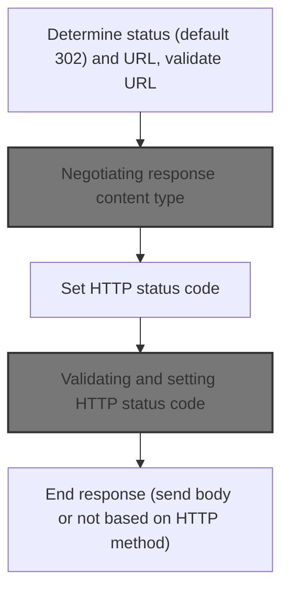
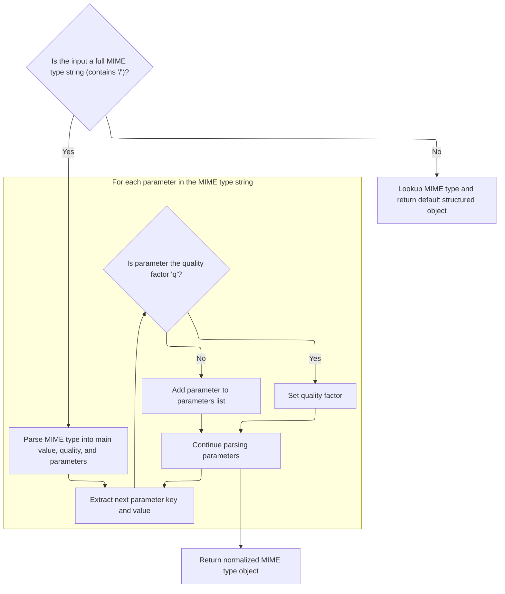
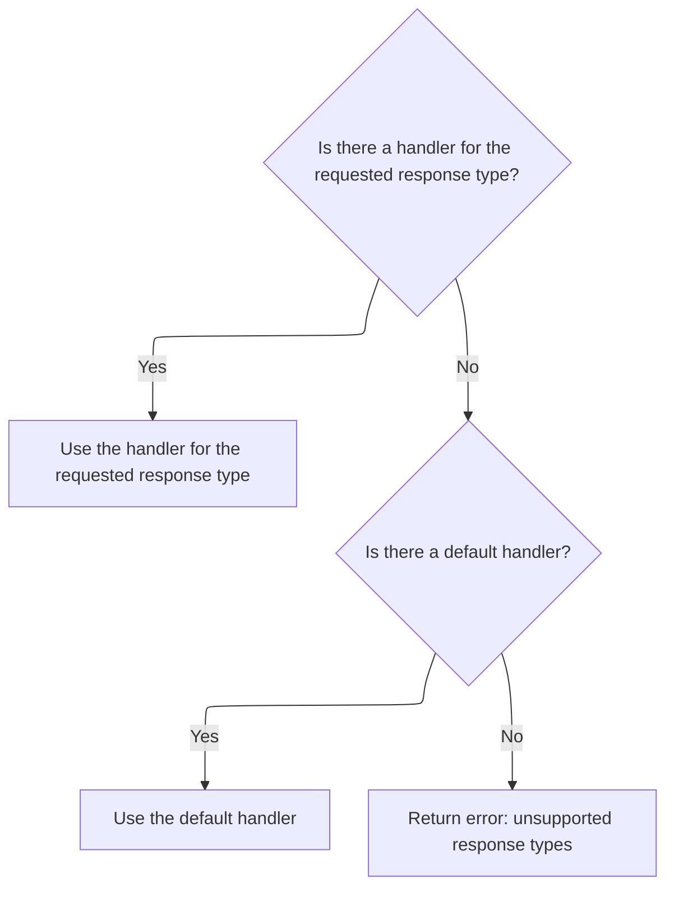
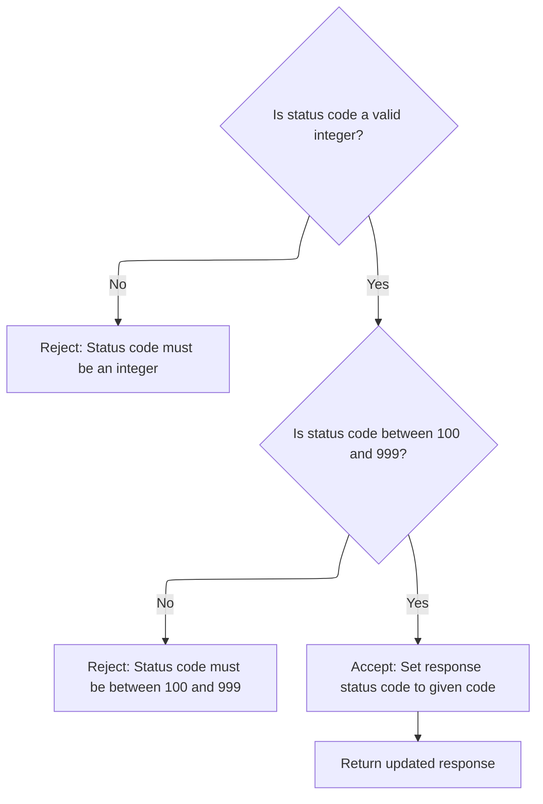

This document explains the flow of performing an HTTP redirect. The flow receives a URL and optionally a status code as input. It negotiates the response content type based on the client's preferences to provide a suitable redirect message. The status code is validated to ensure it is within the valid HTTP range. Finally, the redirect response is sent with the appropriate headers and body, completing the HTTP redirect process.

# Where is this flow used?

This flow is used multiple times in the codebase as represented in the following diagram:

(Note - these are only some of the entry points of this flow)

```mermaid
graph TD;
      3295e1a212829505ec7fc6c1b005a821f32d60b08e6cee3286b372299cb5b010(lib/express.js::createApplication) --> fc53b11ea5da6abc2c89fc15580646db509b4377a7ea7b26fc92569786c709fa(lib/application.js::handle)

3295e1a212829505ec7fc6c1b005a821f32d60b08e6cee3286b372299cb5b010(lib/express.js::createApplication) --> 6ec9d3602e4959e61ed3fd7e8e42d5f07002045c3d1960d2ec6ddc4bdf0e0496(lib/application.js::init)

3295e1a212829505ec7fc6c1b005a821f32d60b08e6cee3286b372299cb5b010(lib/express.js::createApplication) --> e4d3d6cd710719f668961f8ce666afd4565449ff2262650d7813d62198c5852d(index.js::create)

fc53b11ea5da6abc2c89fc15580646db509b4377a7ea7b26fc92569786c709fa(lib/application.js::handle) --> e4d3d6cd710719f668961f8ce666afd4565449ff2262650d7813d62198c5852d(index.js::create)

fc53b11ea5da6abc2c89fc15580646db509b4377a7ea7b26fc92569786c709fa(lib/application.js::handle) --> fc53b11ea5da6abc2c89fc15580646db509b4377a7ea7b26fc92569786c709fa(lib/application.js::handle)

e4d3d6cd710719f668961f8ce666afd4565449ff2262650d7813d62198c5852d(index.js::create) --> 2afcc3a0636914135a2b2d7ba034780b039cf0a9e50b287eb25a710045af4407(lib/response.js::redirect):::mainFlowStyle

6ec9d3602e4959e61ed3fd7e8e42d5f07002045c3d1960d2ec6ddc4bdf0e0496(lib/application.js::init) --> e4d3d6cd710719f668961f8ce666afd4565449ff2262650d7813d62198c5852d(index.js::create)

6ec9d3602e4959e61ed3fd7e8e42d5f07002045c3d1960d2ec6ddc4bdf0e0496(lib/application.js::init) --> 6c12a4d00b8f8ba994eb3dfb7506e3fb87a44544d45a360a35011a7f7f4c5839(lib/application.js::defaultConfiguration)

6c12a4d00b8f8ba994eb3dfb7506e3fb87a44544d45a360a35011a7f7f4c5839(lib/application.js::defaultConfiguration) --> e4d3d6cd710719f668961f8ce666afd4565449ff2262650d7813d62198c5852d(index.js::create)

e40fb758a4a038c3fe85b6e2752bba5d7ea996687a3becb426606e6e43c36468(lib/application.js::mounted_app) --> 9ad090db67bf1aca466b07a69ca4088355594f967b8a5fb48aa049e05bb68c0b(lib/application.js::use)

e40fb758a4a038c3fe85b6e2752bba5d7ea996687a3becb426606e6e43c36468(lib/application.js::mounted_app) --> fc53b11ea5da6abc2c89fc15580646db509b4377a7ea7b26fc92569786c709fa(lib/application.js::handle)

9ad090db67bf1aca466b07a69ca4088355594f967b8a5fb48aa049e05bb68c0b(lib/application.js::use) --> fc53b11ea5da6abc2c89fc15580646db509b4377a7ea7b26fc92569786c709fa(lib/application.js::handle)

9ad090db67bf1aca466b07a69ca4088355594f967b8a5fb48aa049e05bb68c0b(lib/application.js::use) --> 9ad090db67bf1aca466b07a69ca4088355594f967b8a5fb48aa049e05bb68c0b(lib/application.js::use)

a4ea6a802a6702c9a017c94a38ddeb3f5f6646435dd66cb1d38cfe856bfae357(index.js::default) --> 9ad090db67bf1aca466b07a69ca4088355594f967b8a5fb48aa049e05bb68c0b(lib/application.js::use)

5940cb1da7065c64ceb47308c662b707ea87c1cfbcf36d8253e57e9f6c205da9(lib/response.js::download) --> e4d3d6cd710719f668961f8ce666afd4565449ff2262650d7813d62198c5852d(index.js::create)

e1e9823138e4f483cbe498b3d51bb7774085a371b14be32fd86f825e4321f69b(index.js::json) --> 9ad090db67bf1aca466b07a69ca4088355594f967b8a5fb48aa049e05bb68c0b(lib/application.js::use)


classDef mainFlowStyle color:#000000,fill:#7CB9F4
classDef rootsStyle color:#000000,fill:#00FFF4
classDef Style1 color:#000000,fill:#00FFAA
classDef Style2 color:#000000,fill:#FFFF00
classDef Style3 color:#000000,fill:#AA7CB9

%% Swimm:
%% graph TD;
%%       3295e1a212829505ec7fc6c1b005a821f32d60b08e6cee3286b372299cb5b010(<SwmPath>[lib/express.js](lib/express.js)</SwmPath>::createApplication) --> fc53b11ea5da6abc2c89fc15580646db509b4377a7ea7b26fc92569786c709fa(<SwmPath>[lib/application.js](lib/application.js)</SwmPath>::handle)
%% 
%% 3295e1a212829505ec7fc6c1b005a821f32d60b08e6cee3286b372299cb5b010(<SwmPath>[lib/express.js](lib/express.js)</SwmPath>::createApplication) --> 6ec9d3602e4959e61ed3fd7e8e42d5f07002045c3d1960d2ec6ddc4bdf0e0496(<SwmPath>[lib/application.js](lib/application.js)</SwmPath>::init)
%% 
%% 3295e1a212829505ec7fc6c1b005a821f32d60b08e6cee3286b372299cb5b010(<SwmPath>[lib/express.js](lib/express.js)</SwmPath>::createApplication) --> e4d3d6cd710719f668961f8ce666afd4565449ff2262650d7813d62198c5852d(<SwmPath>[index.js](index.js)</SwmPath>::create)
%% 
%% fc53b11ea5da6abc2c89fc15580646db509b4377a7ea7b26fc92569786c709fa(<SwmPath>[lib/application.js](lib/application.js)</SwmPath>::handle) --> e4d3d6cd710719f668961f8ce666afd4565449ff2262650d7813d62198c5852d(<SwmPath>[index.js](index.js)</SwmPath>::create)
%% 
%% fc53b11ea5da6abc2c89fc15580646db509b4377a7ea7b26fc92569786c709fa(<SwmPath>[lib/application.js](lib/application.js)</SwmPath>::handle) --> fc53b11ea5da6abc2c89fc15580646db509b4377a7ea7b26fc92569786c709fa(<SwmPath>[lib/application.js](lib/application.js)</SwmPath>::handle)
%% 
%% e4d3d6cd710719f668961f8ce666afd4565449ff2262650d7813d62198c5852d(<SwmPath>[index.js](index.js)</SwmPath>::create) --> 2afcc3a0636914135a2b2d7ba034780b039cf0a9e50b287eb25a710045af4407(<SwmPath>[lib/response.js](lib/response.js)</SwmPath>::redirect):::mainFlowStyle
%% 
%% 6ec9d3602e4959e61ed3fd7e8e42d5f07002045c3d1960d2ec6ddc4bdf0e0496(<SwmPath>[lib/application.js](lib/application.js)</SwmPath>::init) --> e4d3d6cd710719f668961f8ce666afd4565449ff2262650d7813d62198c5852d(<SwmPath>[index.js](index.js)</SwmPath>::create)
%% 
%% 6ec9d3602e4959e61ed3fd7e8e42d5f07002045c3d1960d2ec6ddc4bdf0e0496(<SwmPath>[lib/application.js](lib/application.js)</SwmPath>::init) --> 6c12a4d00b8f8ba994eb3dfb7506e3fb87a44544d45a360a35011a7f7f4c5839(<SwmPath>[lib/application.js](lib/application.js)</SwmPath>::defaultConfiguration)
%% 
%% 6c12a4d00b8f8ba994eb3dfb7506e3fb87a44544d45a360a35011a7f7f4c5839(<SwmPath>[lib/application.js](lib/application.js)</SwmPath>::defaultConfiguration) --> e4d3d6cd710719f668961f8ce666afd4565449ff2262650d7813d62198c5852d(<SwmPath>[index.js](index.js)</SwmPath>::create)
%% 
%% e40fb758a4a038c3fe85b6e2752bba5d7ea996687a3becb426606e6e43c36468(<SwmPath>[lib/application.js](lib/application.js)</SwmPath>::mounted_app) --> 9ad090db67bf1aca466b07a69ca4088355594f967b8a5fb48aa049e05bb68c0b(<SwmPath>[lib/application.js](lib/application.js)</SwmPath>::use)
%% 
%% e40fb758a4a038c3fe85b6e2752bba5d7ea996687a3becb426606e6e43c36468(<SwmPath>[lib/application.js](lib/application.js)</SwmPath>::mounted_app) --> fc53b11ea5da6abc2c89fc15580646db509b4377a7ea7b26fc92569786c709fa(<SwmPath>[lib/application.js](lib/application.js)</SwmPath>::handle)
%% 
%% 9ad090db67bf1aca466b07a69ca4088355594f967b8a5fb48aa049e05bb68c0b(<SwmPath>[lib/application.js](lib/application.js)</SwmPath>::use) --> fc53b11ea5da6abc2c89fc15580646db509b4377a7ea7b26fc92569786c709fa(<SwmPath>[lib/application.js](lib/application.js)</SwmPath>::handle)
%% 
%% 9ad090db67bf1aca466b07a69ca4088355594f967b8a5fb48aa049e05bb68c0b(<SwmPath>[lib/application.js](lib/application.js)</SwmPath>::use) --> 9ad090db67bf1aca466b07a69ca4088355594f967b8a5fb48aa049e05bb68c0b(<SwmPath>[lib/application.js](lib/application.js)</SwmPath>::use)
%% 
%% a4ea6a802a6702c9a017c94a38ddeb3f5f6646435dd66cb1d38cfe856bfae357(<SwmPath>[index.js](index.js)</SwmPath>::default) --> 9ad090db67bf1aca466b07a69ca4088355594f967b8a5fb48aa049e05bb68c0b(<SwmPath>[lib/application.js](lib/application.js)</SwmPath>::use)
%% 
%% 5940cb1da7065c64ceb47308c662b707ea87c1cfbcf36d8253e57e9f6c205da9(<SwmPath>[lib/response.js](lib/response.js)</SwmPath>::download) --> e4d3d6cd710719f668961f8ce666afd4565449ff2262650d7813d62198c5852d(<SwmPath>[index.js](index.js)</SwmPath>::create)
%% 
%% e1e9823138e4f483cbe498b3d51bb7774085a371b14be32fd86f825e4321f69b(<SwmPath>[index.js](index.js)</SwmPath>::json) --> 9ad090db67bf1aca466b07a69ca4088355594f967b8a5fb48aa049e05bb68c0b(<SwmPath>[lib/application.js](lib/application.js)</SwmPath>::use)
%% 
%% 
%% classDef mainFlowStyle color:#000000,fill:#7CB9F4
%% classDef rootsStyle color:#000000,fill:#00FFF4
%% classDef Style1 color:#000000,fill:#00FFAA
%% classDef Style2 color:#000000,fill:#FFFF00
%% classDef Style3 color:#000000,fill:#AA7CB9
```



# Starting the redirect process



<SwmSnippet path="/lib/response.js" line="819">

---

In <SwmToken path="lib/response.js" pos="819:2:2" line-data="res.redirect = function redirect(url) {">`redirect`</SwmToken>, the function starts by handling two possible argument signatures to set status and URL. It normalizes the Location header using a repo-specific method, then calls <SwmToken path="lib/response.js" pos="846:3:3" line-data="  this.format({">`format`</SwmToken> to set the response body based on content negotiation. It warns about argument types but doesn't throw errors.

```javascript
res.redirect = function redirect(url) {
  var address = url;
  var body;
  var status = 302;

  // allow status / url
  if (arguments.length === 2) {
    status = arguments[0]
    address = arguments[1]
  }

  if (!address) {
    deprecate('Provide a url argument');
  }

  if (typeof address !== 'string') {
    deprecate('Url must be a string');
  }

  if (typeof status !== 'number') {
    deprecate('Status must be a number');
  }

  // Set location header
  address = this.location(address).get('Location');

  // Support text/{plain,html} by default
  this.format({
    text: function(){
      body = statuses.message[status] + '. Redirecting to ' + address
    },

    html: function(){
      var u = escapeHtml(address);
      body = '<p>' + statuses.message[status] + '. Redirecting to ' + u + '</p>'
    },

    default: function(){
      body = '';
    }
  });

```

---

</SwmSnippet>

## Negotiating response content type

<SwmSnippet path="/lib/response.js" line="576">

---

In <SwmToken path="lib/response.js" pos="576:2:2" line-data="res.format = function(obj){">`format`</SwmToken>, the function extracts content types from the input object excluding 'default'. It then checks the request's accepted types to find the best match. It sets the 'Vary' header to 'Accept' to indicate content negotiation. If a match is found, it sets the <SwmToken path="lib/response.js" pos="590:6:8" line-data="    this.set(&#39;Content-Type&#39;, normalizeType(key).value);">`Content-Type`</SwmToken> header and calls the corresponding handler. If no match but a default handler exists, it calls that. Otherwise, it triggers a 406 error.

```javascript
res.format = function(obj){
  var req = this.req;
  var next = req.next;

  var keys = Object.keys(obj)
    .filter(function (v) { return v !== 'default' })

  var key = keys.length > 0
    ? req.accepts(keys)
    : false;

  this.vary("Accept");

  if (key) {
    this.set('Content-Type', normalizeType(key).value);
```

---

</SwmSnippet>

### Normalizing and parsing content types



<SwmSnippet path="/lib/utils.js" line="61">

---

In <SwmToken path="lib/utils.js" pos="61:2:2" line-data="exports.normalizeType = function(type){">`normalizeType`</SwmToken>, the function checks if the input string contains a slash to decide if it needs to parse parameters. If yes, it calls <SwmToken path="lib/utils.js" pos="63:3:3" line-data="    ? acceptParams(type)">`acceptParams`</SwmToken> to parse the type string into value, quality, and params. Otherwise, it looks up the MIME type and returns a default if none found.

```javascript
exports.normalizeType = function(type){
  return ~type.indexOf('/')
    ? acceptParams(type)
```

---

</SwmSnippet>

<SwmSnippet path="/lib/utils.js" line="89">

---

<SwmToken path="lib/utils.js" pos="89:2:2" line-data="function acceptParams (str) {">`acceptParams`</SwmToken> parses a media type string with parameters separated by semicolons. It extracts the main value, looks for key=value pairs, and treats 'q' specially as a quality factor. It skips malformed pairs and collects other parameters into an object.

```javascript
function acceptParams (str) {
  var length = str.length;
  var colonIndex = str.indexOf(';');
  var index = colonIndex === -1 ? length : colonIndex;
  var ret = { value: str.slice(0, index).trim(), quality: 1, params: {} };

  while (index < length) {
    var splitIndex = str.indexOf('=', index);
    if (splitIndex === -1) break;

    var colonIndex = str.indexOf(';', index);
    var endIndex = colonIndex === -1 ? length : colonIndex;

    if (splitIndex > endIndex) {
      index = str.lastIndexOf(';', splitIndex - 1) + 1;
      continue;
    }

    var key = str.slice(index, splitIndex).trim();
    var value = str.slice(splitIndex + 1, endIndex).trim();

    if (key === 'q') {
      ret.quality = parseFloat(value);
    } else {
      ret.params[key] = value;
    }

    index = endIndex + 1;
  }
```

---

</SwmSnippet>

<SwmSnippet path="/lib/utils.js" line="64">

---

After parsing or looking up the MIME type, <SwmToken path="lib/response.js" pos="590:12:12" line-data="    this.set(&#39;Content-Type&#39;, normalizeType(key).value);">`normalizeType`</SwmToken> returns an object with the normalized value and parameters. If lookup fails, it defaults to <SwmToken path="lib/utils.js" pos="64:19:23" line-data="    : { value: (mime.lookup(type) || &#39;application/octet-stream&#39;), params: {} }">`application/octet-stream`</SwmToken>. Next, the flow moves to view resolution to handle file paths for views.

```javascript
    : { value: (mime.lookup(type) || 'application/octet-stream'), params: {} }
};
```

---

</SwmSnippet>

<SwmSnippet path="/lib/view.js" line="104">

---

<SwmToken path="lib/view.js" pos="104:4:4" line-data="View.prototype.lookup = function lookup(name) {">`lookup`</SwmToken> converts the root(s) to an array to handle multiple roots uniformly. It iterates over roots, resolves the full path for the given name, splits it into directory and file, then calls <SwmToken path="lib/view.js" pos="119:5:7" line-data="    path = this.resolve(dir, file);">`this.resolve`</SwmToken> to finalize the path. It stops when a valid path is found.

```javascript
View.prototype.lookup = function lookup(name) {
  var path;
  var roots = [].concat(this.root);

  debug('lookup "%s"', name);

  for (var i = 0; i < roots.length && !path; i++) {
    var root = roots[i];

    // resolve the path
    var loc = resolve(root, name);
    var dir = dirname(loc);
    var file = basename(loc);

    // resolve the file
    path = this.resolve(dir, file);
  }
```

---

</SwmSnippet>

### Finalizing content negotiation in format



<SwmSnippet path="/lib/response.js" line="591">

---

After getting the normalized content type from <SwmToken path="lib/response.js" pos="590:12:12" line-data="    this.set(&#39;Content-Type&#39;, normalizeType(key).value);">`normalizeType`</SwmToken>, <SwmToken path="lib/response.js" pos="576:2:2" line-data="res.format = function(obj){">`format`</SwmToken> sets the <SwmToken path="lib/response.js" pos="590:6:8" line-data="    this.set(&#39;Content-Type&#39;, normalizeType(key).value);">`Content-Type`</SwmToken> header and calls the handler for that type. If no match is found but a default handler exists, it calls that. Otherwise, it triggers a 406 error. It returns the response object for chaining.

```javascript
    obj[key](req, this, next);
  } else if (obj.default) {
    obj.default(req, this, next)
  } else {
    next(createError(406, {
      types: normalizeTypes(keys).map(function (o) { return o.value })
    }))
  }

  return this;
};
```

---

</SwmSnippet>

<SwmSnippet path="/lib/response.js" line="846">

---

The default handler sets an empty response body for clients that don't accept text or HTML.

```javascript
    default: function(){
      body = '';
    }
```

---

</SwmSnippet>

## Completing redirect response setup

<SwmSnippet path="/lib/response.js" line="861">

---

After <SwmToken path="lib/response.js" pos="576:2:2" line-data="res.format = function(obj){">`format`</SwmToken> returns in <SwmToken path="lib/response.js" pos="819:2:2" line-data="res.redirect = function redirect(url) {">`redirect`</SwmToken>, the function sets the HTTP status code using <SwmToken path="lib/response.js" pos="862:3:3" line-data="  this.status(status);">`status`</SwmToken>. This prepares the response status for the redirect.

```javascript
  // Respond
  this.status(status);
```

---

</SwmSnippet>

## Validating and setting HTTP status code



<SwmSnippet path="/lib/response.js" line="64">

---

In <SwmToken path="lib/response.js" pos="64:2:2" line-data="res.status = function status(code) {">`status`</SwmToken>, the function validates that the code is an integer within the valid HTTP status range. This prevents invalid status codes. After validation, it proceeds to stringify any related data if needed.

```javascript
res.status = function status(code) {
  // Check if the status code is not an integer
  if (!Number.isInteger(code)) {
    throw new TypeError(`Invalid status code: ${JSON.stringify(code)}. Status code must be an integer.`);
  }
  // Check if the status code is outside of Node's valid range
  if (code < 100 || code > 999) {
    throw new RangeError(`Invalid status code: ${JSON.stringify(code)}. Status code must be greater than 99 and less than 1000.`);
  }

```

---

</SwmSnippet>

<SwmSnippet path="/lib/response.js" line="1029">

---

<SwmToken path="lib/response.js" pos="1029:2:2" line-data="function stringify (value, replacer, spaces, escape) {">`stringify`</SwmToken> converts a value to JSON string with optional formatting. If escaping is enabled, it replaces <, >, and & with their Unicode escapes to prevent HTML injection issues.

```javascript
function stringify (value, replacer, spaces, escape) {
  // v8 checks arguments.length for optimizing simple call
  // https://bugs.chromium.org/p/v8/issues/detail?id=4730
  var json = replacer || spaces
    ? JSON.stringify(value, replacer, spaces)
    : JSON.stringify(value);

  if (escape && typeof json === 'string') {
    json = json.replace(/[<>&]/g, function (c) {
      switch (c.charCodeAt(0)) {
        case 0x3c:
          return '\\u003c'
        case 0x3e:
          return '\\u003e'
        case 0x26:
          return '\\u0026'
        /* istanbul ignore next: unreachable default */
        default:
          return c
      }
    })
  }

  return json
}
```

---

</SwmSnippet>

<SwmSnippet path="/lib/response.js" line="74">

---

After <SwmToken path="lib/response.js" pos="67:19:19" line-data="    throw new TypeError(`Invalid status code: ${JSON.stringify(code)}. Status code must be an integer.`);">`stringify`</SwmToken> returns, <SwmToken path="lib/response.js" pos="64:2:2" line-data="res.status = function status(code) {">`status`</SwmToken> sets the internal <SwmToken path="lib/response.js" pos="74:3:3" line-data="  this.statusCode = code;">`statusCode`</SwmToken> property to the validated code and returns the response object for chaining.

```javascript
  this.statusCode = code;
  return this;
};
```

---

</SwmSnippet>

## Sending the redirect response

<SwmSnippet path="/lib/response.js" line="863">

---

In <SwmToken path="lib/response.js" pos="819:2:2" line-data="res.redirect = function redirect(url) {">`redirect`</SwmToken> after setting status, the function sets the <SwmToken path="lib/response.js" pos="863:6:8" line-data="  this.set(&#39;Content-Length&#39;, Buffer.byteLength(body));">`Content-Length`</SwmToken> header based on the body size. It ends the response immediately for HEAD requests without a body, otherwise sends the body. This respects HTTP protocol.

```javascript
  this.set('Content-Length', Buffer.byteLength(body));

  if (this.req.method === 'HEAD') {
    this.end();
  } else {
    this.end(body);
  }
};
```

---

</SwmSnippet>

&nbsp;

*This is an auto-generated document by Swimm 🌊 and has not yet been verified by a human*

<SwmMeta version="3.0.0" repo-id="Z2l0aHViJTNBJTNBSmF2YVNjcmlwdEV4cHJlc3MlM0ElM0FHb3BpbmF0aHJlZGR5NjY=" repo-name="JavaScriptExpress"><sup>Powered by [Swimm](https://app.swimm.io/)</sup></SwmMeta>
